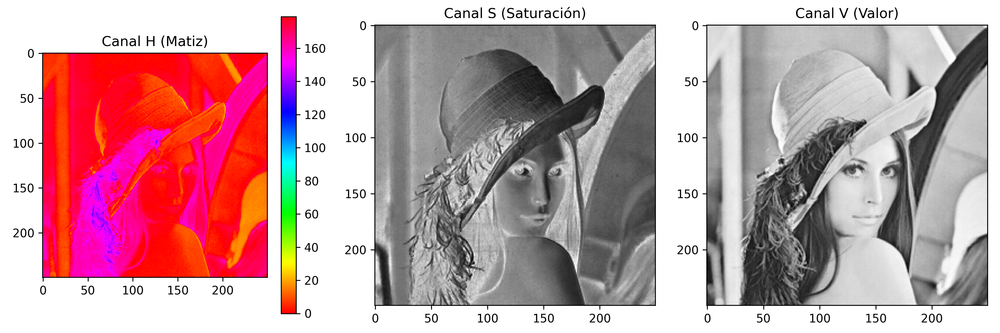
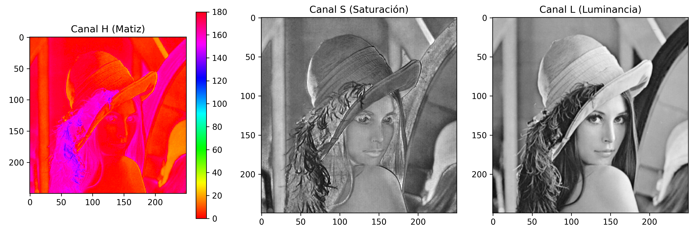
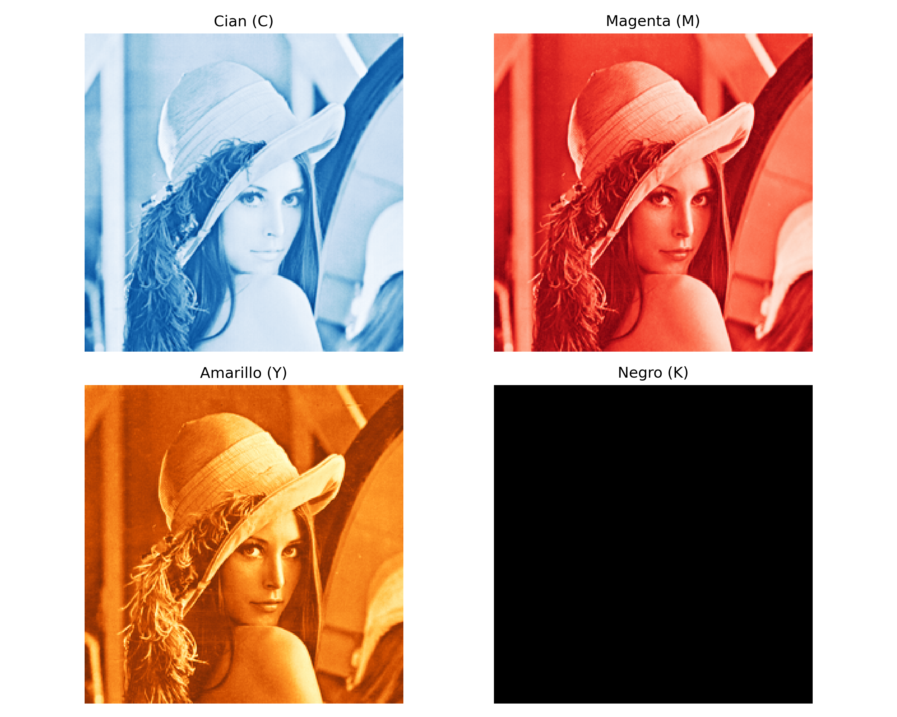
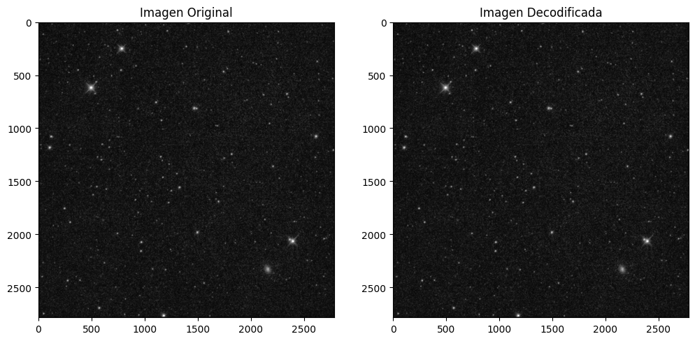

# Procesamiento de Imágenes - 2025
## TP1

### Integrantes
- **Andrés Maglione** - **13753**
- **Yeumen Silva** - **13693**

### Introducción
El presente trabajo práctico corresponde a la unidad 1 de la materia Procesamiento de Imágenes. En el mismo, se desarrollan los ejercicios correspondientes al trabajo práctico utilizando Python y librerías como OpenCV, PIL y NumPy. 

El objetivo es aplicar técnicas de procesamiento de imágenes para familiarizarse con las herramientas y conceptos básicos de la materia, modos de color y compresión de imágenes.

Este documento contiene una breve descripción de los ejercicios realizados y respuestas a las preguntas teóricas planteadas en el trabajo práctico. Para ver el desarrollo completo, dirigirse al notebook con el código fuente (`TP1.ipynb`) o al PDF generado a partir del mismo (`TP1.pdf`).

### Parte 1: Modos de color en imágenes

#### 6. (*) La conversión de una imagen de color a escala de grises se puede hacer de varias formas. El ejercicio consiste en convertir la imagen de Lenna color a escala de grises utilizando diferentes métodos.

Consultar el ejericicio 6 de la parte 1 del notebook [`TP1.pdf`](TP1.pdf) para ver el código.

##### (a) Usando la libreria cv2 y el método cvtColor()

##### (b) Usando la fórmula de luminancia

La fórmula de luminancia está dada por: $0.299 \cdot r + 0.587 \cdot g + 0.114 \cdot b$

En donde r,g y b corresponden a los canales de color.

##### (c) Usando scickit-image y el método rgb2gray()

##### (d) ¿Qué pasa con los canales?

Se pierde la información cromática ya que pasamos de tener 3 canales (RGB) a un único canal (escala de grises).

Shape original (RGB): (250, 250, 3)
Shape gray cvt: (250, 250)
Shape gray luminance: (250, 250)
Shape gray scickit: (250, 250)

##### (e) ¿Qué profundidad de bits tiene la imagen?

La imagen en escala de grises tiene menor profundidad total por píxel, ya que tiene un único canal de 8 bits, mientras que la imagen a color tiene tres canales de 8 bits cada uno, sumando un total de 24 bits por píxel.

Shape original (RGB): (250, 250, 3)
Shape gray: (250, 250)

##### (f) Evaluar con otra imagen de mayor profundidad

La siguiente imágen cuenta con una profunidad de 16 bits y fue creada utilizand openCV y numpay.

##### (g) ¿Qué sucede con la imagen? ¿Ha cambiado algo?

Aunque la imagen fue creada con una profundidad de 16 bits por canal, visualmente no se aprecian diferencias con respecto a una imagen de 8 bits. Esto se debe a que la mayoría de los monitores y visores de imágenes estándar están diseñados para mostrar imágenes en formato de 8 bits por canal, lo cual limita la cantidad de niveles de intensidad que pueden representarse visualmente. Como resultado, al visualizar una imagen de 16 bits en estos dispositivos, los valores se escalan o truncados automáticamente para ajustarse al rango visible (0–255), descartando parte de la información adicional.

#### 7. (*) Convertir la imagen de Lenna a otros modos de color, como CMYK, HSV, HSL. Mostrar el
resultado.

Para cada modelo de color (CMYK, HSV, HSL), se mostrarán los canales por separado, ya que si simplemente se visualizara la imagen convertida directamente, esta seguiría viéndose en el formato RGB. Esto ocurre porque las pantallas y visores de imágenes están diseñados para interpretar y representar los valores de color en el espacio RGB. Por lo tanto, para observar cómo se distribuye la información en cada componente del modelo de color (por ejemplo, Cian, Magenta, Amarillo y Negro en CMYK), es necesario visualizar cada canal como una imagen en escala de grises, donde la intensidad refleja el valor del canal correspondiente.

Consultar el ejericicio 7 de la parte 1 del pdf [`TP1.pdf`](TP1.pdf) para ver el código.

##### HSV

##### HSL

##### CMYK

#### 8. (*) Tomar la imagen convertida en escala de grises y volver a convertir al en modo RGB. ¿Qué ha sucedido?

Al convertir una imagen en escala de grises nuevamente al modo RGB, no se recupera el color original. Esto se debe a que durante la conversión a escala de grises se pierde la información cromática: el color se reduce a una sola intensidad por píxel, que representa la luminosidad promedio de los canales rojo, verde y azul. Al reconvertir esa imagen gris a RGB, simplemente se replica ese mismo valor de intensidad en los tres canales, resultando en una imagen en tonos de gris pero codificada como RGB. Es decir, cada píxel ahora tiene valores R=G=B, lo cual visualmente sigue siendo una imagen en escala de grises, pero con el formato estructural de una imagen a color.

Consultar el ejericicio 8 de la parte 1 del pdf [`TP1.pdf`](TP1.pdf) para ver el código.

### Parte 2: Compresión de imágenes
#### 2. (*) Dar detalles de las siguientes métricas de calidad de compresión (PSNR, SSIM)
**PSNR (Peak Signal-To-Noise Ratio)**: esta métrica mide la relación de señal a ruido entre la imagen original y la imagen comprimida. Se expresa en decibeles (dB) y se mide **píxel a píxel**. Un PSNR más alto indica una mejor calidad de la imagen comprimida en comparación con la original. Se calcula utilizando la siguiente fórmula:

1. Obtener el MSE (Mean Squared Error) entre la imagen original y la imagen comprimida (considerando que el tamaño de las imágenes es el mismo, N x M, y que $I(x,y)$ es el valor de intensidad del píxel en la posición (x,y) de la imagen): 
$$MSE = \dfrac{1}{N \cdot M} \sum_{x=1}^N \sum_{y=1}^M (I_{original}(x,y) -  I_{comprimida}(x,y))^2$$
2. Calcular el PSNR utilizando la siguiente fórmula:
$$PSNR = 10 \cdot log_{10} \left( \dfrac{MAX^2}{MSE} \right)$$
donde $MAX$ es el valor máximo posible de un píxel (255 para imágenes de 8 bits por canal).

La fórmula anterior aplica para imágenes en escala de grises. Para imágenes a color, se calcula el PSNR para cada canal (R, G, B) y se promedian los resultados.

**SSIM (Structural Similarity Index)**: esta métrica mide la similitud estructural entre dos imágenes. A diferencia del PSNR, que se basa en la diferencia píxel a píxel, el SSIM tiene en cuenta la luminancia, el contraste y la estructura de las imágenes, lo que resulta en una medida más similar a la percepción humana. El SSIM varía entre 0 y 1, donde 1 indica que las imágenes son idénticas y valores cercanos a 0 indican poca.

No se agrega la fórmula del SSIM, ya que es más compleja, pero es importante conocer que se calculan a partir de medidas estadísticas de la imagen original y la imagen comprimida, como la media, la varianza y la covarianza.

#### 6. (*) Implementar un modelo de compresión basado en codificación Run-Length Encoding (RLE). El algoritmo Run-Length Encoding (RLE) reduce el tamaño de una imagen representando secuencias consecutivas de píxeles idénticos como una sola entrada. Para ello convertir una imagen en escala de grises. luego, implementar el algoritmo RLE para comprimir la imagen. Posteriormente, implementar una función para descomprimir la imagen. Al finalizar, mostrar la imagen original y la imagen reconstruida. Probar con dos o tres imagenes que tengan diferentes características, modos de color. utilizar alguna de las metricas nombradas anteriormente y evaluar el resultado de la misma.

Imagen original: 03.tif | Tamaño: 17497 kb |2784x2784 | 8 bits
Imagen encodeada: 03.tif | Tamaño: 12185 kb |  2784x2784 | 8 bits
Factor de compresión: 1.44x
Índice SSIM: 1.0000

---
Imagen original: 02.jpg | Tamaño: 678 kb |1920x885 | 8 bits
Imagen encodeada: 02.jpg | Tamaño: 2711 kb |  1920x885 | 8 bits
Factor de compresión: 0.25x
Índice SSIM: 1.0000

---
Los resultados obtenidos fureon los siguientes

- Todas las imágenes de entrada tenían una profundidad de bits de 8 y diferentes formatos.
- La compresión RLE no modificó la resolución de las imágenes.
- Por tratarse de una compresión sin pérdida, la calidad de las imágenes originales y reconstruidas es idéntica, lo que significa que el resultado de aplicar SSIM es siempre 1.
- En todos los casos excepto en el primero, el tamaño del archivo comprimido fue mayor que el tamaño del archivo original. Esto se debe a que las imágenes de entrada ya pertenecían a formatos comprimidos (jpg) o no contaban con grandes regiones de color uniformes. La última imagen formato Bitmap sí experimentó una reducción en el tamaño.

Para más ejemplos, consultar el jupyter notebook