# Procesamiento de Imágenes - 2025
## TP2

### Integrantes
- **Andrés Maglione** - **13753**
- **Yeumen Silva** - **13693**

### Introducción
El presente trabajo práctico corresponde a la unidad 2 de la materia Procesamiento de Imágenes. En esta ocasión, se abordan temas relacionados con histogramas, combinación de imágenes y técnicas aplicadas en el dominio espacial, utilizando Python junto con librerías como OpenCV, NumPy y Matplotlib.

El objetivo principal es profundizar en el análisis y manipulación de imágenes digitales a través del uso de histogramas, la fusión de diferentes imágenes y la aplicación de filtros espaciales, fortaleciendo así la comprensión de estos conceptos fundamentales del procesamiento de imágenes.

Este documento presenta una breve descripción de los ejercicios realizados y las respuestas a las preguntas teóricas incluidas en el trabajo práctico. Para consultar el desarrollo completo y los resultados obtenidos, se puede acceder al notebook con el código fuente (`TP2.ipynb`) o al PDF generado a partir del mismo (`TP2.pdf`).

### Parte 1: Histogramas

#### 7. (*) Transformar la distribución de intensidades de una imagen para que se parezca a la de otra. Implementar el ajuste de histograma usando OpenCV o skimage.exposure.match histograms(). Comparar los histogramas antes y después del ajuste.

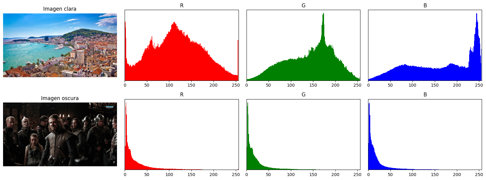
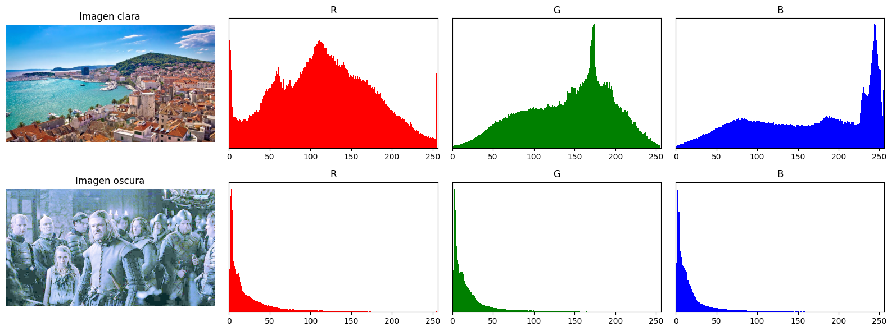

---
Fragmento del código
```python
img_light = cv2.imread(image_paths[0])
img_dark = cv2.imread(image_paths[1])
img_light_rgb = cv2.cvtColor(img_light, cv2.COLOR_BGR2RGB)
img_dark_rgb = cv2.cvtColor(img_dark, cv2.COLOR_BGR2RGB)

img_matched = match_histograms(img_dark_rgb, img_light_rgb, channel_axis=-1).astype(np.uint8)
images = [img_light_rgb, img_matched]

for i, img_rgb in enumerate(images):
    # Calcular histogramas RGB
    hist_r = cv2.calcHist([cv2.cvtColor(img_rgb, cv2.COLOR_RGB2BGR)], [2], None, [256], [0, 256]).flatten()
    hist_g = cv2.calcHist([cv2.cvtColor(img_rgb, cv2.COLOR_RGB2BGR)], [1], None, [256], [0, 256]).flatten()
    hist_b = cv2.calcHist([cv2.cvtColor(img_rgb, cv2.COLOR_RGB2BGR)], [0], None, [256], [0, 256]).flatten()
    
    histograms.append([hist_r, hist_g, hist_b])

    # Mostrar imagen
```


#### 8. (*) Aplicar ecualización de histograma a una imagen en escala de grises. Comparar la imagen original con la ecualizada

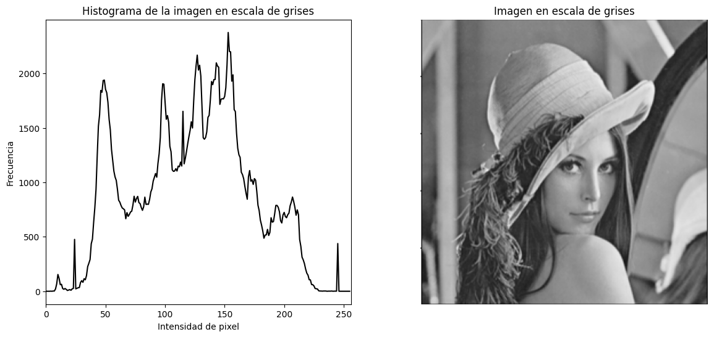
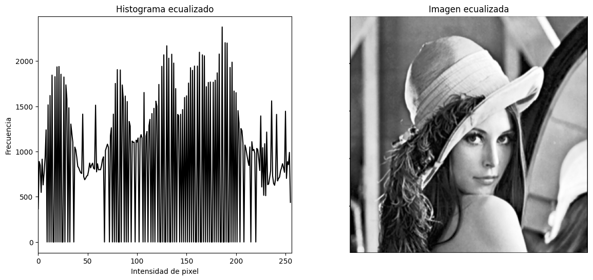
Visualmente, se puede apreciar que el contraste de la imagen es mayor que el de la imagen original. Esto se debe a que la ecualización de histograma redistribuye los valores de intensidad de la imagen original para que estén más uniformemente distribuidos en el rango de intensidades posibles.

Por otro lado, la imagen pierde visiblemente suavidad: se nota las diferencias abruptas de intensidad en los píxeles, lo que puede ser un efecto no deseado en algunas aplicaciones. 

---
Fragmento del código
```python
image = cv2.imread(image_path, cv2.IMREAD_GRAYSCALE)
hist = cv2.calcHist([image], [0], None, [256], [0, 256])

image_eq = cv2.equalizeHist(image)
hist_eq = cv2.calcHist([image_eq], [0], None, [256], [0, 256])

### Mostrar Comparacion usando matplotlib
```

#### 9. (*) Implementar una umbralización manual eligiendo un valor de umbral. Usar el método de Otsu para calcular un umbral óptimo automáticamente.

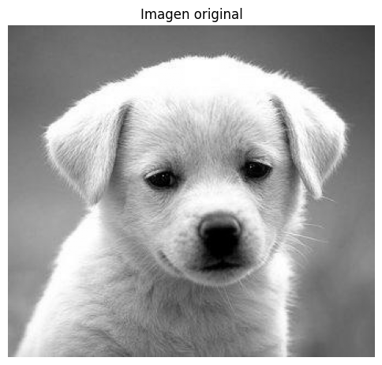
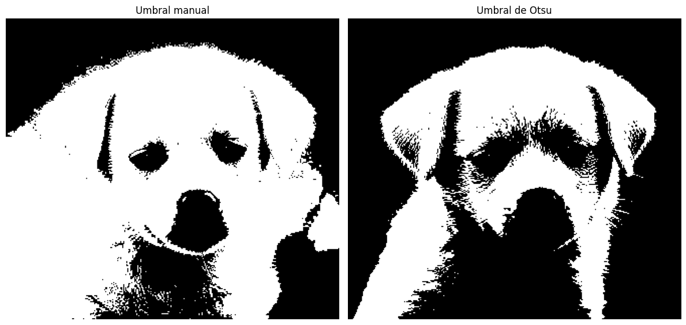

---
Fragmento del código
```python
image_path = './part1/8/dog.jpg'
image = cv2.imread(image_path, cv2.IMREAD_GRAYSCALE)

# Definir umbral
threshold = 125

# Aplicar umbral
_, manual_threshold = cv2.threshold(image, threshold, 255, cv2.THRESH_BINARY)

# Usar el algoritmo de Otsu
_, otsu_threshold = cv2.threshold(image, 0, 255, cv2.THRESH_BINARY + cv2.THRESH_OTSU)
### Mostrar resultado
```

#### 11. (*) Implementar la transformación gamma I’=Iy, permitiendo ajustar el valor de y dinámicamente. Aplicar diferentes valores de y en distintas regiones de la imagen (por ejemplo, usando una máscara o adaptando y en funci´on del brillo local). Visualizar el efecto de la corrección gamma en la imagen y en su histograma

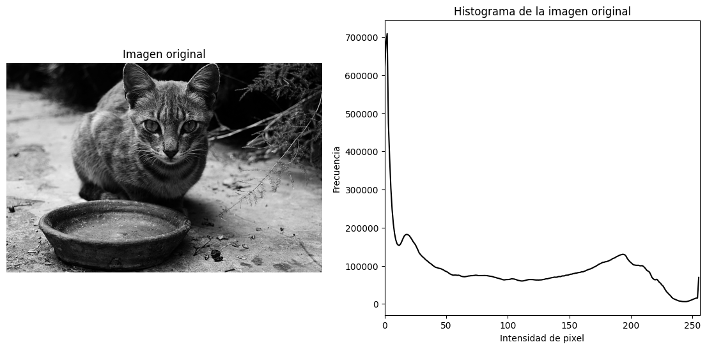
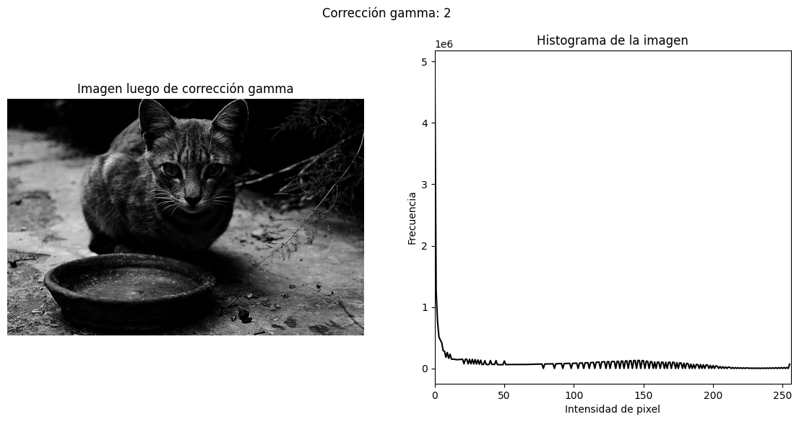
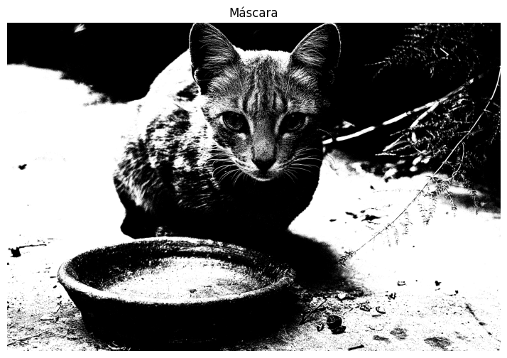
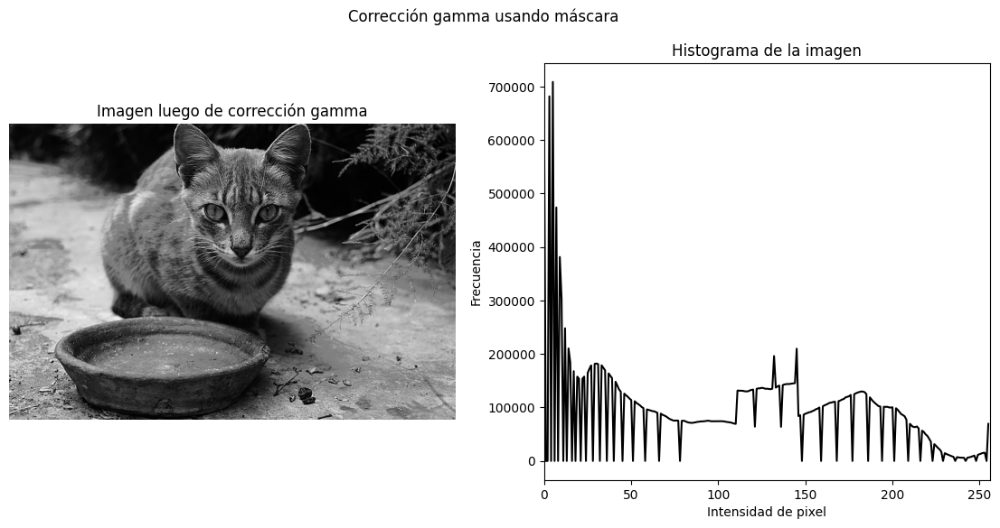
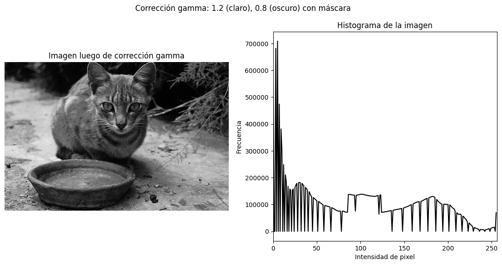

---
Fragmento del código
```python
def gamma_correction(image, gamma):
    image_normalized = image / 255.0
    # Aplicar la corrección gamma
    image_corrected = np.power(image_normalized, gamma)
    
    # Normalizar la imagen corregida
    image_corrected = np.clip(image_corrected * 255, 0, 255).astype(np.uint8)
    return image_corrected


# 1. Aplicar una gamma a toda la imagen
gamma = 2
image_gamma = gamma_correction(image, gamma)
plot_image_and_histogram(image_gamma, f'Corrección gamma: {gamma}')

# 2. Aplicar gammas distintos a las regiones claras y oscuras
gamma_light = 1.2
gamma_dark = 0.8

corrected = image.copy()
corrected[image > 127] = gamma_correction(image[image > 127], gamma_light)
corrected[image <= 127] = gamma_correction(image[image <= 127], gamma_dark)

plot_image_and_histogram(corrected, 'Corrección gamma usando máscara')

# 3. Usar una máscara para aplicar la corrección gamma
image_copy = image.copy()
_, mask = cv2.threshold(image_copy, 0, 255, cv2.THRESH_BINARY + cv2.THRESH_OTSU)


# Show the mask
plt.figure(figsize=(14, 6))
plt.title('Máscara')
plt.imshow(mask, cmap='gray')
plt.axis('off')
plt.show()

# Aplicar la corrección gamma a la imagen original usando la máscara
image_gamma_masked = image.copy()
image_gamma_masked[mask == 255] = gamma_correction(image[mask == 255], gamma_light)
image_gamma_masked[mask == 0] = gamma_correction(image[mask == 0], gamma_dark)
plot_image_and_histogram(image_gamma_masked, f'Corrección gamma: {gamma_light} (claro), {gamma_dark} (oscuro) con máscara')
```


--- 

### Parte 2: Combinación de Imágenes

Las imágenes con las cuales se va a trabajar en el inciso 3 tienen las siguintes características:

| Resolución     | Profundidad de color | Tamaño     |
|----------------|----------------------|------------|
| 980 x 980      | 8 bits               | 58588 KB    |
| 980 x 980      | 8 bits               | 102759 KB    |

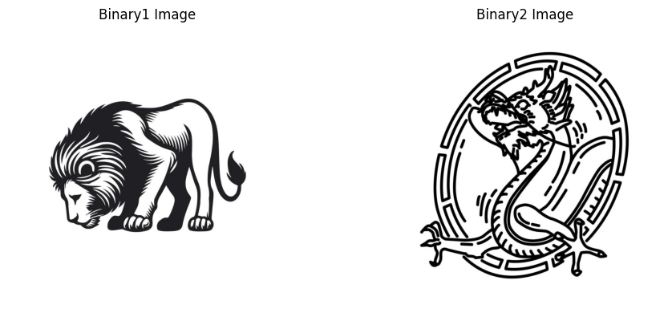

#### 3. (*) Multiplicación y división de imágenes: Multiplicar y divide dos imágenes pı́xel a pı́xel utilizando cv2.multiply() y cv2.divide(), observando cómo afecta el brillo y contraste.

Estos son los resultados de aplicar **cv2.multiply** y **cv2.divide**

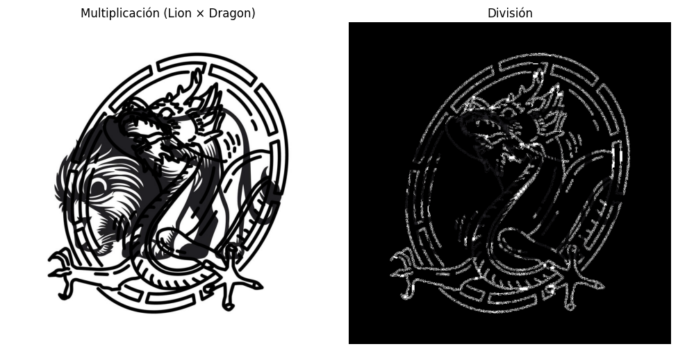

En la imagen de la izquierda, correspondiente a la multiplicación de las imágenes del león y el dragón, se observa una superposición oscura en las zonas donde ambos patrones tienen trazos negros, resultando en un refuerzo de esas líneas. Las áreas claras (blancas) se mantienen sin cambios, ya que al multiplicarse por valores cercanos a 1 no alteran significativamente el resultado. Esta operación hace que los elementos compartidos entre ambas imágenes resalten más, pero las regiones con bajo valor en una de las imágenes tienden a oscurecerse notablemente, como se nota en el cuerpo del dragón donde se cruza con la melena del león.

En la imagen de la derecha, correspondiente a la división, el resultado invierte la intensidad en muchas regiones: los contornos del dragón aparecen brillantes sobre un fondo negro, especialmente en las zonas donde la imagen del león tiene valores oscuros y actúa como divisor. Esta operación crea un efecto de realce, haciendo visibles detalles que estaban menos marcados en las imágenes originales. El fondo completamente negro indica zonas donde el denominador (imagen del león) tenía valores altos, lo que reduce el resultado final a valores bajos, intensificando el contraste.

Consultar el ejericicio 3 de la parte 2 del pdf [`TP2.pdf`](TP2.pdf) para ver el código.


#### 5. (*) Combinación con operadores lógicos: Usa operadores booleanos (cv2.bitwise and, cv2.bitwise or, cv2.bitwise xor) para fusionar imágenes basándose en una máscara binaria. Describir que sucede en cada caso.

A continuación podemos observar las dos imágenes utilizadas y luego, las operaciones **and, or** y **xor**

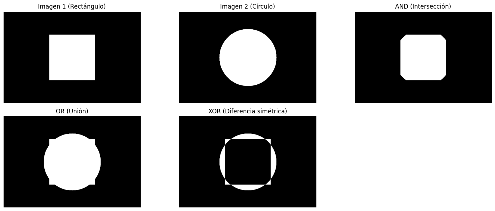

- **and** Mantiene solo los píxeles donde ambas imágenes tienen valores distintos de cero en el área de la máscara. Es útil para extraer regiones comunes: si un píxel es negro (0) en una imagen o en la máscara, el resultado será negro.

- **or** Combina todas las áreas donde al menos una imagen tiene píxeles no nulos en la máscara. Si un píxel es blanco (255) en una imagen o en la máscara, el resultado será blanco.

- **xor** Destaca píxeles donde solo una de las imágenes tiene valores no nulos (exclusividad). Si un píxel difiere entre las dos imágenes (una es blanca y la otra negra), XOR lo mostrará como blanco; si son iguales, será negro.

Consultar el ejericicio 5 de la parte 2 del pdf [`TP2.pdf`](TP2.pdf) para ver el código.

#### 8. (*) Uso de operadores lógicos para reemplazar partes de una imagen: Reemplazar un área especı́fica de una imagen con otra utilizando operadores lógicos y relacionales para definir la región de interés (ROI).

Se utilizó la siguiente máscara: $$(\text{Red} > 100) \land (\text{Blue} > 200) \lor \lnot(\text{Green} < 100)$$ En esta fórmula estamos especificando que queremos remplazar los píxeles que tengan un valor en su canal R mayor a 100 y un valor en su canala B mayor a 200 o la negación de en su canal G un valor menor a 100.

El resultado fue el siguiente:

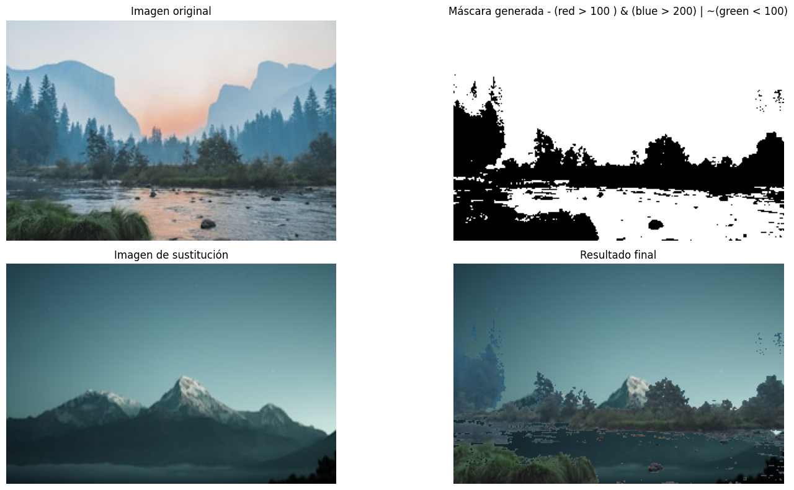

Consultar el ejericicio 8 de la parte 2 del pdf [`TP2.pdf`](TP2.pdf) para ver el código.


### Parte 3: Dominio Espacial

#### 8. Suavizado y Sobel (*): Aplicar un filtro gaussiano antes del operador de Sobel y analizar las diferencias en la detección de bordes.

En el filtro Gaussiano se aplicó la siguiente configuración:
- **Tamaño del kernel**: $5 \times 5$  
- **Desviación estándar ($\sigma$)**: 1

Mientras que en el fitrlo de Sobel se aplicó la siguiente configuración:

- **Tamaño del kernel**: $3 \times 3$ 

Obteniendo como resultado la siguiente imágen:

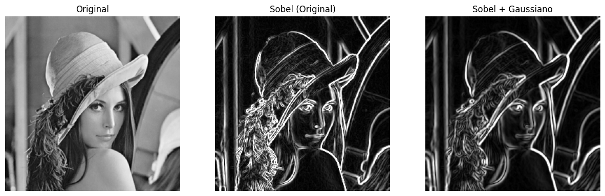

Aplicar un filtro gaussiano antes del operador de Sobel permite reducir el ruido presente en la imagen. En la comparación, se observa que el resultado de aplicar Sobel directamente sobre la imagen original presenta bordes más marcados, pero también puede acentuar el ruido. En cambio, al aplicar primero el suavizado gaussiano, los bordes se ven ligeramente más suaves pero más limpios y definidos, mostrando únicamente las estructuras más relevantes de la imagen.

Consultar el ejericicio 8 de la parte 3 del pdf [`TP2.pdf`](TP2.pdf) para ver el código.

#### 12. (*) Comparación de Métodos de Detección de Bordes : Comparar Sobel, Prewitt, Laplace y Canny trabajando diversas imágenes con caracterı́sticas diferentes.

Se va a trabajar con las siguientes imágenes:

- **Bordes Nítidos**:  
  Imagen con contornos claramente definidos, donde el sujeto principal (una persona con una cámara) se distingue fácilmente del fondo.

- **Granulada**:  
  Imagen con fuerte presencia de ruido, lo que genera un efecto granulado que dificulta la lectura y análisis. El ruido interfiere con la claridad del texto.

- **Fondo con Textura**:  
  Imagen de una hoja con fórmulas matemáticas sobre una superficie texturizada. Aunque el contenido es legible, la textura de fondo puede confundir los algoritmos de segmentación.

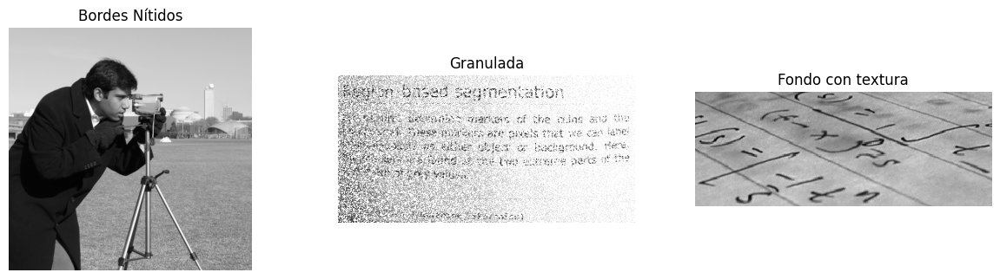

A continuación podemos ver las distintas imágenes con los distintos filtros aplicados:

En el filtro de Sobel se aplicó la siguiente configuración:
- **Tamaño del kernel**: $3 \times 3$  

En el filtro de Prewitt se utilizaron los siguientes kernels:

1. **Dirección X** (horizontal):
   $$
   G_x = \begin{bmatrix} -1 & 0 & 1 \\ -1 & 0 & 1 \\ -1 & 0 & 1 \end{bmatrix}
   $$
   - Responde a cambios **verticales** en la imagen.

2. **Dirección Y** (vertical):
   $$
   G_y = \begin{bmatrix} 1 & 1 & 1 \\ 0 & 0 & 0 \\ -1 & -1 & -1 \end{bmatrix}
   $$
   - Responde a cambios **horizontales** en la imagen.

En el filtro de Laplace se aplicó la siguiente configuración:
- **Tamaño del kernel**: $3 \times 3$ 

En el filtro de Canny se aplicó la siguiente configuración:
- **threshold1**: 150
- **threshold2**: 100

Ahora podemos observar una comparación de los filtros aplicados a cada imágen:

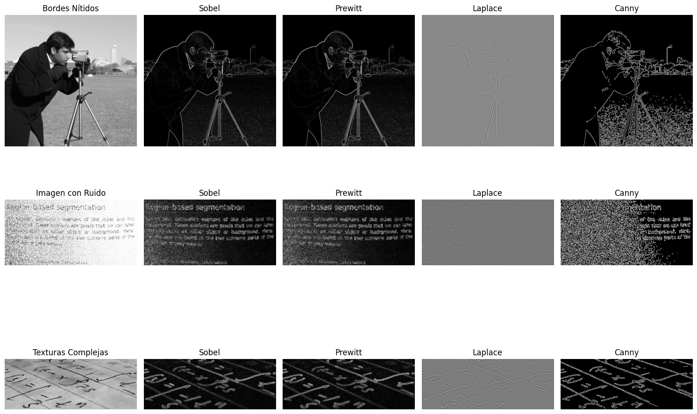

En la foto del hombre con la cámara, Sobel y Prewitt destacan por su nitidez en las siluetas, mientras que Laplace genera una imagen más tenue y con menos detalle. Mientras que Canny tiene problemas con el suelo de la imágen ya que se epxresa con demasiado detalle el pasto. 

En la imagen con mucho ruido, Laplace responde excesivamente al ruido, generando una textura muy saturada y poco útil. Sobel y Prewitt logran capturar el texto pero con bastante interferencia del ruido. Canny tiene los mismos problemas que con la fila de arriba.

En la imágen con texturas complejas como fórmulas matemáticas, todos los métodos detectan contornos, pero Sobel y Prwitt logran un mejor equilibrio entre detalle y claridad. Canny, especialmente, sobresale por separar con precisión las estructuras relevantes del fondo. 

Consultar el ejericicio 12 de la parte 3 del pdf [`TP2.pdf`](TP2.pdf) para ver el código.

#### 13. (*) Realce de Detalles: Aplicar un filtro de paso alto y sumarlo a la imagen original para mejorar los detalles.

Se usó el siguiente kernel de paso alto personalizado:

$$
K = \begin{bmatrix} 
1 & 2 & 1 \\ 
0 & 0 & 0 \\ 
-1 & -2 & -1 
\end{bmatrix}
$$

y se usó un **α** = 0.80 y un **β** = 0.20 para obtener el siguiente resultado

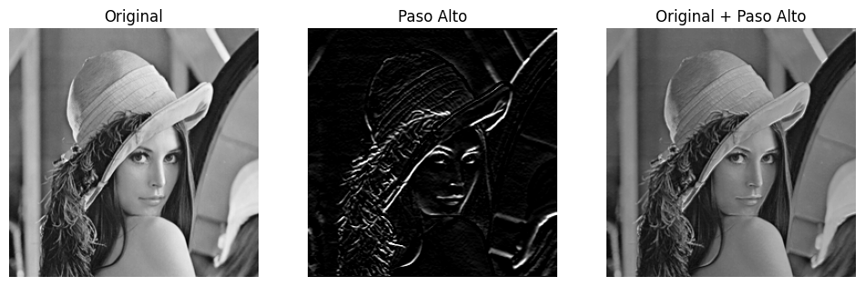

Al sumar la imagen original con su versión de paso alto, se realzan los bordes y se intensifican los detalles sin perder la información original.  
  - Esto genera una imagen más nítida, con mayor contraste local, lo que mejora la percepción visual y la definición general.  
  - El rostro, el sombrero y la pluma presentan líneas más marcadas y definidas, lo que contribuye a una apariencia más clara y atractiva.

Consultar el ejericicio 13 de la parte 3 del pdf [`TP2.pdf`](TP2.pdf) para ver el código.

#### 15. (*) Filtro de Diferencia Gaussiana (DoG): Aplicar la técnica de Diferencia de Gaussiana para resaltar bordes.

En el primer filtro Gaussiano se aplicó la siguiente configuración:
- **Tamaño del kernel**: $5 \times 5$  
- **Desviación estándar ($\sigma$)**: 1.0

En el segundo filtro Gaussiano se aplicó la siguiente configuración:
- **Tamaño del kernel**: $5 \times 5$  
- **Desviación estándar ($\sigma$)**: 3.0

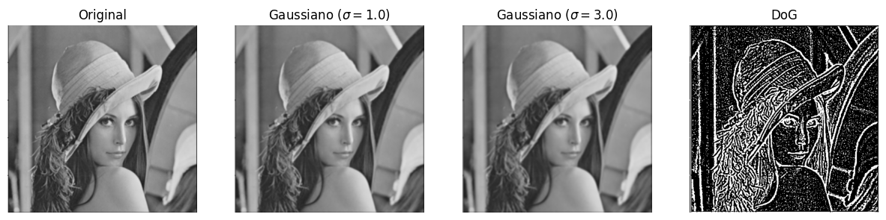

Resultado de restar la imagen suavizada con σ = 3.0 de la suavizada con σ = 1.0.  
  - El DoG actúa como un detector de bordes al resaltar las regiones donde hay cambios bruscos de intensidad.  
  - Las texturas y contornos se hacen claramente visibles, mientras que las zonas homogéneas permanecen oscuras.  

Consultar el ejericicio 15 de la parte 3 del pdf [`TP2.pdf`](TP2.pdf) para ver el código.