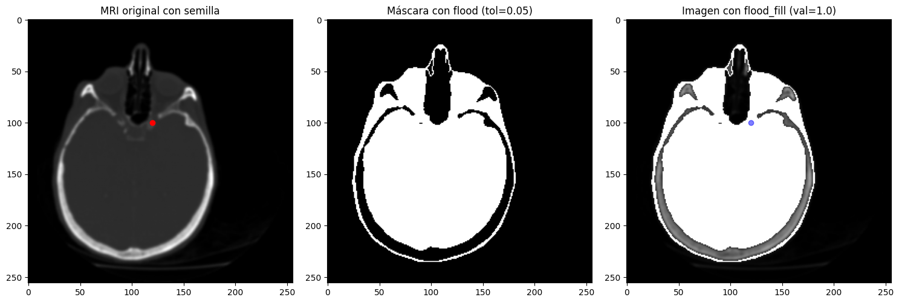

# Procesamiento de Imágenes - 2025
## TP5

### Integrantes
- **Andrés Maglione** - **13753**
- **Yeumen Silva** - **13693**

### Introducción
El presente trabajo práctico corresponde a la Unidad 5 de la materia Procesamiento de Imágenes. En esta ocasión, se abordan distintas técnicas de segmentación, uno de los procesos fundamentales en visión por computadora, ya que permite dividir una imagen en regiones significativas que representan objetos o áreas de interés.

El objetivo principal es comprender y aplicar diversos enfoques de segmentación, desde métodos clásicos basados en umbrales hasta técnicas avanzadas que emplean aprendizaje automático y modelos profundos. Se exploran métodos como la umbralización global y adaptativa, operaciones morfológicas, segmentación por bordes, por regiones, por clustering (como K-means), la transformación de cuenca (watershed), y modelos de segmentación semántica con redes neuronales.

Además, se analiza cómo la combinación de técnicas puede mejorar los resultados de segmentación en escenarios complejos. Cada ejercicio parte de una imagen específica incluida en los archivos proporcionados, y busca ilustrar tanto la aplicación práctica como las ventajas y limitaciones de cada enfoque.

Este documento presenta una descripción general de los ejercicios desarrollados y las respuestas a las preguntas teóricas planteadas en el trabajo. Para consultar el código fuente y los resultados completos, se puede acceder al notebook (`TP5.ipynb`) o al PDF generado (`TP5.pdf`).

### Ejercicios

#### 3. (*) Umbralización hı́brida (combinación de Otsu + morfologı́a). ¿Cómo mejorar la segmentación de objetos con ruido o regiones conectadas? Práctica sugerida: Aplicar Otsu, luego refinar con cv2.morphologyEx() (apertura o cierre).

Para el siguiente ejercicio se utilizó una imagen de mitosis humana de `skimag` la cual tiene regiones conectadas, se le aplicó la técnica de **Otsu** y luego se le aplicaron distintos operadores morfológicos como lo son **cierre**, **apertura**, **erosión** y **dilatación**.

**Otsu + Cierre:** Prácticamente no vemos diferencias a simple vista, pero se han rellenado pequeños huecos en el interior de algunos núcleos. Esto ayuda a representar de manera más sólida los núcleos que se encontraban fragmentados o con regiones de baja intensidad.

**Otsu + Apertura:** Podemos observar que se han eliminado pequeñas regiones blancas que probablemente corresponden a ruido o núcleos mal definidos. Además, el contorno de los núcleos es más limpio y continuo, lo que facilita un conteo más preciso.

**Otsu + Erosión:** Elimina muchas regiones pequeñas y separa algunos núcleos que estaban parcialmente conectados, pero también reduce el tamaño de los núcleos y puede hacer que pierdan parte de su estructura interna, lo cual podría afectar un análisis morfológico más detallado.

**Otsu + Dilatación:** Los núcleos se ven más grandes y los contornos están más cerrados. Esto permite unir fragmentos rotos, pero también provoca que núcleos cercanos se fusionen, dificultando la separación entre células individuales.

Lo ideal es siempre hacer un análisis previo de la imagen para aplicar Otsu y luego el operador morfológico necesario según lo que necesitemos.

Consultar el ejericicio 3 del pdf [`TP5.pdf`](TP5.pdf) para ver el código.

#### 4. (*) Segmentación por detección de bordes. ¿Cómo se puede usar la información de bordes para segmentar una imagen? Práctica sugerida: Detectar bordes con cv2.Canny() o skimage.filters.sobel, luego aplicar umbral y cerrar regiones con morfologı́a.

Para el siguiente ejercicio se cargó una imagen a la cual se le aplicaron tanto **Sobel** como **Canny** por separado, luego se aplicó una umbralización **Otsu** y por ultimo se aplicaron operadores morfológicos de **cierre** y **dilatación** a cada resultado por separado para así cerrar regiones.

Primero, observamos que los bordes extraídos con Canny generan una buena delimitación de los contornos del personaje, con líneas finas y bien definidas. El operador Sobel, por su parte, produce una imagen en escala de grises con bordes más difusos pero igualmente detectables.

Luego, se aplicó la umbralización automática de Otsu sobre los resultados de Canny y Sobel. Esta etapa permite aislar los bordes más destacables. En ambos casos, el resultado mejora la legibilidad de las estructuras, cerrando parte de los contornos y eliminando ruido de baja intensidad. La versión Otsu Sobel presenta bordes más gruesos y continuos, mientras que Otsu Canny conserva una mayor fidelidad en los detalles finos.

Finalmente, se aplicaron transformaciones morfológicas como el cierre y la dilatación a los resultados binarizados. El cierre ayudó a unir bordes fragmentados y rellenar huecos, generando figuras más sólidas y conectadas, aunque con pérdida de detalles internos. La dilatación, por su parte, expandió los contornos segmentados, haciendo que las regiones sean más visibles y compactas, pero también menos precisas en cuanto a la forma original.

Consultar el ejericicio 4 del pdf [`TP5.pdf`](TP5.pdf) para ver el código.

#### 8. (*) Segmentación basada en regiones (crecimiento o split-merge). ¿Cómo se puede segmentar una imagen expandiendo regiones homogéneas? Práctica sugerida: Usar skimage.segmentation.flood() o flood fill() para realizar crecimiento de regiones desde semillas.

En este ejercicio se utilizó una imagen médica (MRI cerebral) para aplicar un método de segmentación basada en crecimiento de regiones.

En este ejercicio se utilizó una imagen médica (MRI cerebral) para aplicar un método de **segmentación basada en crecimiento de regiones**.

Primero, se aplicó un **suavizado gaussiano** a la imagen para reducir el ruido y mejorar la homogeneidad local, lo cual facilita una expansión más controlada y coherente de las regiones. 

A continuación, se seleccionó un **punto de semilla** en la coordenada `(100, 120)`, desde donde se inició el crecimiento de región. La expansión se realizó bajo una **tolerancia de similitud de intensidad de `0.05`**, lo que significa que solo se incluyen en la región aquellos píxeles cuya intensidad no difiera demasiado respecto al valor en la semilla.

Se utilizó la función `flood()` para generar una **máscara binaria** que identifica los píxeles conectados a la semilla bajo esta condición de tolerancia. Luego, se aplicó `flood_fill()` para **rellenar esa región** con un nuevo valor (`1.0`), lo cual permite modificar o resaltar visualmente el área segmentada.

La segmentación de una imagen mediante crecimiento de regiones, funciona iniciando desde un punto o conjunto de puntos denominados semillas. A partir de estas semillas, el algoritmo examina los píxeles vecinos y los agrega a la región si cumplen un criterio de homogeneidad predefinido, como una diferencia de intensidad similar dentro de una tolerancia específica. Este proceso se repite iterativamente, expandiendo la región hasta que no se encuentren más píxeles vecinos que satisfagan el criterio. Este proceso depende mucho de la semilla y tolerancia elegida, pero es muy útil para segmentar y definir regiones sin mucho ruido y bien delimitadas.

Consultar el ejericicio 8 del pdf [`TP5.pdf`](TP5.pdf) para ver el código.

#### 10. (*) Segmentación por combinación de técnicas (pipeline) Pregunta: ¿Qué beneficios tiene combinar varias técnicas de segmentación en un mismo flujo de procesamiento? Práctica sugerida: Aplicar primero Canny + morfologı́a para generar una máscara, luego segmentar con Watershed o K-means sobre la región recortada.

En este ejercicio se trabajó con una imagen a color aplicando un **pipeline de segmentación**, es decir, una secuencia de técnicas complementarias que actúan en conjunto para lograr una segmentación más robusta.

Primero, se convirtió la imagen a escala de grises y se aplicó el **detector de bordes de Canny** para obtener una representación clara de los contornos presentes. Posteriormente, se utilizó **morfología matemática (dilatación)** con un kernel de tamaño $1 \times 1$ para que las regiones no se expandan demasiado, realzando los bordes y generar una **máscara binaria** que delimita las regiones de interés.

Esta máscara se invirtió para seleccionar áreas internas, no bordes, y se utilizó luego como filtro espacial para restringir la segmentación a zonas bien definidas.

En la segunda etapa del pipeline, se aplicó **K-means clustering** sobre los píxeles de la imagen original en el espacio de color, agrupándolos en **25 clusters** según su similitud cromática. Esto permitió segmentar la imagen en regiones de color homogéneo.

Finalmente, se aplicó la **máscara derivada del procesamiento morfológico sobre los bordes** para conservar solo las regiones segmentadas por K-means que coinciden con las zonas estructuralmente delimitadas por los bordes de Canny.

Este enfoque combinado permite aprovechar tanto la **información estructural (bordes)** como la **información de color**, mejorando la precisión de la segmentación y reduciendo el ruido o agrupamientos irrelevantes.

Combinar varias técnicas de segmentación en un pipeline permite aprovechar las fortalezas de cada método para obtener un resultado más preciso y robusto.

Por ejemplo, usar Canny detecta los bordes más relevantes de una imagen; aplicar operaciones morfológicas (como dilatación o cierre) mejora la conectividad y limpieza de esos bordes; luego, técnicas como K-means o Watershed pueden segmentar regiones internas con mayor coherencia, al trabajar solo sobre áreas importantes delimitadas por la máscara.

Esto reduce el procesamiento de zonas irrelevantes (como el fondo), evita errores de sobresegmentación y mejora la calidad visual y estructural del resultado final.

Consultar el ejericicio 10 del pdf [`TP5.pdf`](TP5.pdf) para ver el código.

#### 11. (*) Elegir y describir alguno de las siguientes tecnicas de segmentación:
    (a) Basada en Clustering
    (b) Basada en Grafos
    (c) Basadas en Modelos Probabilı́sticos y Estadı́sticas

#### Explicación de la Técnica

Para la segementación basada en grafos, se representa la imágen como un grafo fully no dirigído connected (lo cual tiene un alto coste computacional) en el cual cada pixel es un nodo y hay una arista por cada par de píxeles `p` y `q` (cada arista tienen un peso que mide la similitud entre píxeles). Se puede observar en la siguiente imagen:

La segmentación basada en grafos consiste en eliminar ciertas aristas del grafo para dividirlo en componentes. Las aristas con mayor peso son cnadidatas a corte ya que probablemente separan regiones distintas. Se puede observar en la siguiente imagen:

#### Diferentes algoritmos

Existen diferentes algoritmos para la segmentación basada en grafos:

**Normalized Cut**

Se basa en minimizar la relación entre el coste del corte y la suma de los pesos de las aristas dentro de cada segemento.

Divide recursivamente el grafo en subgrafos más pequeños hasta que se cumplen los criterios de parada.

**Minimum Cut**

Se basa en buscar el corte mínimo en el grafo (el corte con el menor peso).

El algoritmo parte el grafo en dos segmentos removiendo los bordes con pesos más pequeños hasta desconectarlo.

#### Ventajas y desventajas

| Factor      | Ventajas                                                                 | Desventajas                                                                 |
|-------------|--------------------------------------------------------------------------|------------------------------------------------------------------------------|
| Flexibilidad | Aplica a distintos tipos de imágenes y características (color, textura). | Requiere ajustar varios parámetros (pesos, criterios de partición).         |
| Precisión    | Capta detalles finos y contornos usando información local y global.      | Puede generar sobresegmentación si el grafo se divide incorrectamente.      |
| Eficiencia   | Algoritmos rápidos y aptos para imágenes grandes y tiempo real.          | Técnica compleja que exige muchos recursos y es difícil de implementar.     |

#### Bibliografía

Kak, A. (s/f). Graph-Based Techniques for Image Segmentation. Purdue.edu. Recuperado el 3 de junio de 2025, de https://engineering.purdue.edu/kak/Tutorials/GraphBased.pdf

(S/f-a). Princeton.edu. Recuperado el 3 de junio de 2025, de https://www.cs.princeton.edu/courses/archive/spr18/cos598B/slides/cos598b_7feb18_graphcut.pdf

(S/f-b). Baeldung.com. Recuperado el 3 de junio de 2025, de https://www.baeldung.com/cs/graph-based-segmentation

