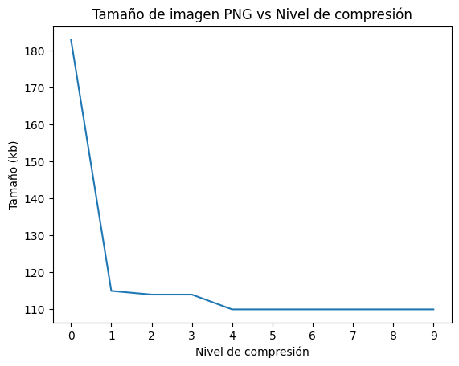
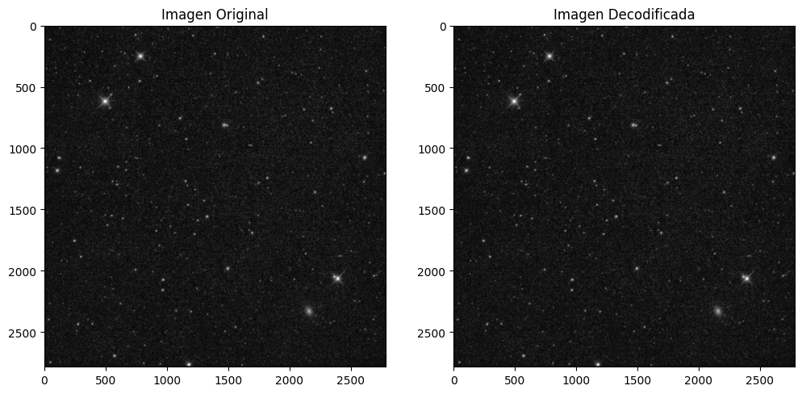
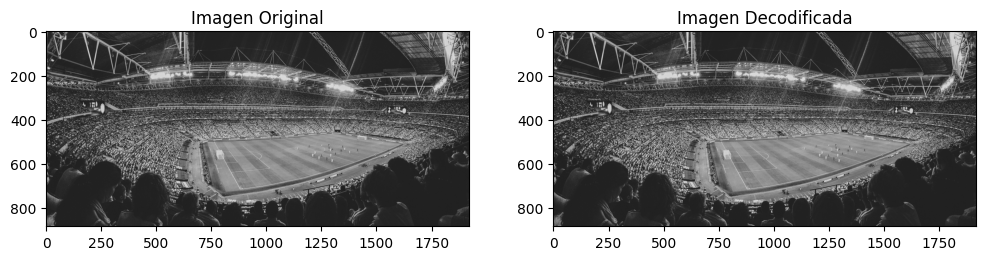

# Procesamiento de Imágenes - 2025
## TP1

### Integrantes
- **Andrés Maglione** - **13753**
- **Yeumen Silva** - **Legajo**

### Introducción
El presente trabajo práctico corresponde a la unidad 1 de la materia Procesamiento de Imágenes. En el mismo, se desarrollan los ejercicios correspondientes al trabajo práctico utilizando Python y librerías como OpenCV, PIL y NumPy. 

El objetivo es aplicar técnicas de procesamiento de imágenes para familiarizarse con las herramientas y conceptos básicos de la materia, modos de color y compresión de imágenes.

Este documento contiene una breve descripción de los ejercicios realizados y respuestas a las preguntas teóricas planteadas en el trabajo práctico. Para ver el desarrollo completo, dirigirse al notebook con el código fuente (`TP1.ipynb`) o al PDF generado a partir del mismo (`TP1.pdf`).

### Parte 1: Modos de color en imágenes

### Parte 2: Compresión de imágenes
#### 1. ¿El formato BMP es un formato de compresion?
No, el formato BMP (Bitmap) no es un formato de compresión. Por el contrario, este formato, no tiene compresión, sino que almacena los píxels de forma directa, lo que suele resultar en archivos grandes.

#### 2. (*) Dar detalles de las siguientes métricas de calidad de compresión (PSNR, SSIM)
**PSNR (Peak Signal-To-Noise Ratio)**: esta métrica mide la relación de señal a ruido entre la imagen original y la imagen comprimida. Se expresa en decibeles (dB) y se mide **píxel a píxel**. Un PSNR más alto indica una mejor calidad de la imagen comprimida en comparación con la original. Se calcula utilizando la siguiente fórmula:

1. Obtener el MSE (Mean Squared Error) entre la imagen original y la imagen comprimida (considerando que el tamaño de las imágenes es el mismo, N x M, y que $I(x,y)$ es el valor de intensidad del píxel en la posición (x,y) de la imagen): 
$$MSE = \dfrac{1}{N \cdot M} \sum_{x=1}^N \sum_{y=1}^M (I_{original}(x,y) -  I_{comprimida}(x,y))^2$$
2. Calcular el PSNR utilizando la siguiente fórmula:
$$PSNR = 10 \cdot log_{10} \left( \dfrac{MAX^2}{MSE} \right)$$
donde $MAX$ es el valor máximo posible de un píxel (255 para imágenes de 8 bits por canal).

La fórmula anterior aplica para imágenes en escala de grises. Para imágenes a color, se calcula el PSNR para cada canal (R, G, B) y se promedian los resultados.

**SSIM (Structural Similarity Index)**: esta métrica mide la similitud estructural entre dos imágenes. A diferencia del PSNR, que se basa en la diferencia píxel a píxel, el SSIM tiene en cuenta la luminancia, el contraste y la estructura de las imágenes, lo que resulta en una medida más similar a la percepción humana. El SSIM varía entre 0 y 1, donde 1 indica que las imágenes son idénticas y valores cercanos a 0 indican poca.

No se agrega la fórmula del SSIM, ya que es más compleja, pero es importante conocer que se calculan a partir de medidas estadísticas de la imagen original y la imagen comprimida, como la media, la varianza y la covarianza.

#### 3. ¿Cúal es el impacto de la compresión en el procesamiento posterior de una imagen?
Para responder a esta pregunta, es necesario tener en cuenta el tipo de compresión que se aplica a la imagen y qué tarea se desea realizar posteriormente.

En principio, si utilizamos compresión sin pérdida, no debería haber un impacto significativo en el procesamiento posterior de la imagen, más allá del _overhead_ de tiempo que puede llevar descomprimir la imagen antes de procesarla (usualmente despreciable).

Por otro lado, la compresión con pérdida puede afectar a las tareas posteriores, aunque debe realizarse un análisis caso a caso. Generalmente, si el factor de compresión es relativamente bajo (y la tarea no es extremadamente sensible) el impacto será mínimo [\[1\]](https://arxiv.org/pdf/1604.04004) [\[2\]](https://arxiv.org/pdf/2409.16733). Un mayor factor de compresión puede llevar a una pérdida de información significativa, lo que puede traer problemas como los _Artifacts JPEG_ o la pérdida de detalles en la imagen. 

#### 4. Cargar una imagen en color. Guarda la imagen con diferentes niveles de calidad (ejemplo: 90%, 50%, 10%). Comparar el tamaño, resolución, calidad, profundidad de bits de los archivos y la pérdida de calidad. ¿Qué puede comentar de las im ágenes resultantes?

La pérdida de calidad es imperceptible en las imágenes con calidad 50% y 90%, pero en la imagen con calidad 10% se observa gran pérdida de calidad, particularmente en el fondo (los anteriormente mencionados _Artifacts JPEG_). 

En cuanto al tamaño de los archivos, la imagen con calidad 10% tiene un 25% del tamaño de la imagen original, mientras que la imagen con calidad 50% tiene un 65%. Contraintuivamente, la imagen con calidad 90% tiene un tamaño mayor al original. Esto se debe a que la construcción de la imagen JPEG involucra eliminar datos redundantes y reemplazarlos por metadata. En este caso, como se mantienen casi todos los datos de la imagen original, el tamaño del archivo es mayor al original.

La profundidad de bits y resolución de las imágenes no cambian, ya que la compresión JPEG no afecta a estos parámetros. La profundidad de bits se mantiene en 8 bits por canal y la resolución es la misma que la imagen original (6000x4000)

#### 5. Guardar una imagen en formato PNG con distintos niveles de compresión (0 a 9). Comparar el tamaño de los archivos generados.

En el gráfico anterior, podemos observar que el tamaño disminuye apenas aumentamos el nivel de compresión de cero.
Esto ocurre solo hasta cierto punto, ya que a partir de un nivel de compresión de 4, el tamaño de los archivos se mantiene constante (igual al original PNG).

#### 6. (*) Implementar un modelo de compresión basado en codificación Run-Length Encoding (RLE). El algoritmo Run-Length Encoding (RLE) reduce el tamaño de una imagen representando secuencias consecutivas de píxeles idénticos como una sola entrada. Para ello convertir una imagen en escala de grises. luego, implementar el algoritmo RLE para comprimir la imagen. Posteriormente, implementar una función para descomprimir la imagen. Al finalizar, mostrar la imagen original y la imagen reconstruida. Probar con dos o tres imagenes que tengan diferentes características, modos de color. utilizar alguna de las metricas nombradas anteriormente y evaluar el resultado de la misma.

Imagen original: 03.tif | Tamaño: 17497 kb |2784x2784 | 8 bits
Imagen encodeada: 03.tif | Tamaño: 12185 kb |  2784x2784 | None bits
Factor de compresión: 1.44x
Índice SSIM: 1.0000

---
Imagen original: 02.jpg | Tamaño: 678 kb |1920x885 | 8 bits
Imagen encodeada: 02.jpg | Tamaño: 2711 kb |  1920x885 | 8 bits bits
Factor de compresión: 0.25x
Índice SSIM: 1.0000

---
Los resultados obtenidos fureon los siguientes

- Todas las imágenes de entrada tenían una profundidad de bits de 8 y diferentes formatos.
- La compresión RLE no modificó la resolución de las imágenes.
- Por tratarse de una compresión sin pérdida, la calidad de las imágenes originales y reconstruidas es idéntica, lo que significa que el resultado de aplicar SSIM es siempre 1.
- En todos los casos excepto en el primero, el tamaño del archivo comprimido fue mayor que el tamaño del archivo original. Esto se debe a que las imágenes de entrada ya pertenecían a formatos comprimidos (jpg) o no contaban con grandes regiones de color uniformes. La última imagen formato Bitmap sí experimentó una reducción en el tamaño.

Para más ejemplos, consultar el jupyter notebook