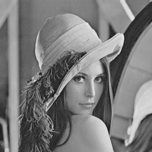
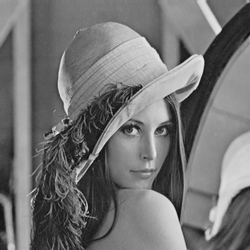
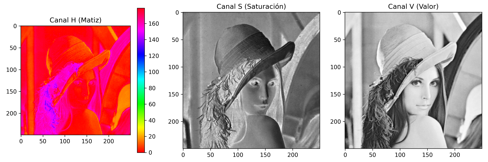
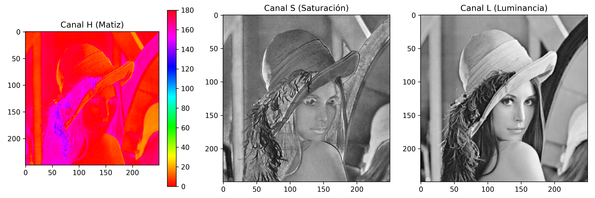
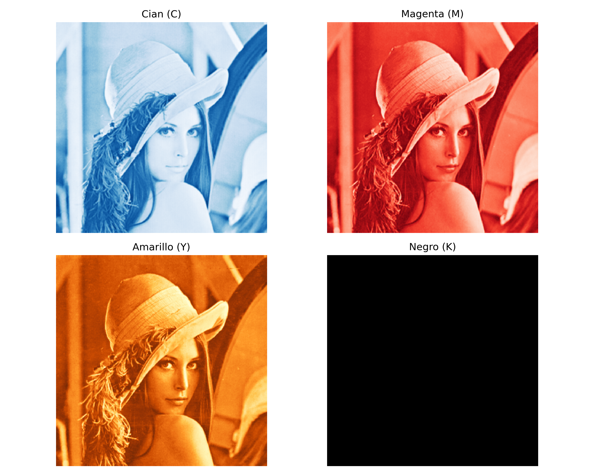
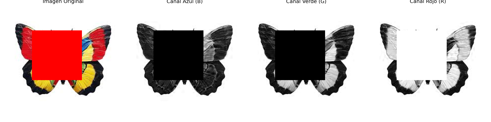

# Procesamiento de Imágenes - 2025
## TP1

### Integrantes
- **Andrés Maglione** - **13753**
- **Yeumen Silva** - **Legajo**

### Introducción
El presente trabajo práctico corresponde a la unidad 1 de la materia Procesamiento de Imágenes. En el mismo, se desarrollan los ejercicios correspondientes al trabajo práctico utilizando Python y librerías como OpenCV, PIL y NumPy. 

El objetivo es aplicar técnicas de procesamiento de imágenes para familiarizarse con las herramientas y conceptos básicos de la materia, modos de color y compresión de imágenes.

Este documento contiene una breve descripción de los ejercicios realizados y respuestas a las preguntas teóricas planteadas en el trabajo práctico. Para ver el desarrollo completo, dirigirse al notebook con el código fuente (`TP1.ipynb`) o al PDF generado a partir del mismo (`TP1.pdf`).

### Parte 1: Modos de color en imágenes
#### 1. Utilizando openCV en python, cargar una imagen RGB y mostrarla en una ventana utilizando el comando imread() y imshow(), tambien puede utilizar matplotlib para mstrarla.

##### Imágen cargada con **imread()** y visualización con **imshow()**

##### Imágen cargada con **imread()** y visualización con **matplotlib**

#### 2. Una vez cargada la imagen de muestra podemos empezar usando numpy y su función array para obtener el arreglo de valores de intensidad para cada uno de los canales de color.
La array resultante tiene un shape (225, 225, 3) en el cual podemos ver que el tercer valor a cada canal de color.

#### 3. Retomando con el ejercicio 1, analizar la imagen cargada ¿Existe algún problema con los colores mostrados con respecto a la imagen original?

Los colores de usar imshow() y matplotlib son diferentes ya que al cargar la imágen con imread() los colores se guardan en formáto BGR:

- **imshow()** está diseñado para trabajar y mostrar la imágen usando formato BGR ya que tanto imread() como imshow() pertenecen a la mimsa libreria.
- **matplotlib** trabaja con formato RGB por lo tanto los colores rojo y azul están invertidos

#### 4. Cargar la imagen pero antes de mostrarla utilizar el comando cvtColor(). ¿Qué sucede ahora?

Al utilizar la función cvtColor() y pasar de formáto BGR a formáto RGB los colores de la imágen utilizando matplotlib se visualizan correctamente.

#### 5. Utilizar la función split() para una imagen RGB y separar en canales.

Al utilizar la función **split()** debemos tener en cuenta que la imágen deber ser cargada utilizando **imread()** o en otro caso utilizar **cvtColor()** para asegurarnos que la imágen se encuentra en formáto BGR ya que **split()** separa los canales siguiendo este formáto.

#### 6. (*) La conversión de una imagen de color a escala de grises se puede hacer de varias formas. El ejercicio consiste en convertir la imagen de Lenna color a escala de grises utilizando diferentes métodos.

##### (a) Usando la libreria cv2 y el método cvtColor()

##### (b) Usando la fórmula de luminancia

La fórmula de luminancia está dada por: $0.299 \cdot r + 0.587 \cdot g + 0.114 \cdot b$

En donde r,g y b corresponden a los canales de color.

##### (c) Usando scickit-image y el método rgb2gray()

##### (d) ¿Qué pasa con los canales?

Se pierde la información cromática ya que pasamos de tener 3 canales (RGB) a un único canal (escala de grises).

Shape original (RGB): (250, 250, 3)
Shape gray cvt: (250, 250)
Shape gray luminance: (250, 250)
Shape gray scickit: (250, 250)

##### (e) ¿Qué profundidad de bits tiene la imagen?

La imagen en escala de grises tiene menor profundidad total por píxel, ya que tiene un único canal de 8 bits, mientras que la imagen a color tiene tres canales de 8 bits cada uno, sumando un total de 24 bits por píxel.

Shape original (RGB): (250, 250, 3)
Shape gray: (250, 250)

##### (f) Evaluar con otra imagen de mayor profundidad

La siguiente imágen cuenta con una profunidad de 16 bits y fue creada utilizand openCV y numpay.

##### (g) ¿Qué sucede con la imagen? ¿Ha cambiado algo?

Aunque la imagen fue creada con una profundidad de 16 bits por canal, visualmente no se aprecian diferencias con respecto a una imagen de 8 bits. Esto se debe a que la mayoría de los monitores y visores de imágenes estándar están diseñados para mostrar imágenes en formato de 8 bits por canal, lo cual limita la cantidad de niveles de intensidad que pueden representarse visualmente. Como resultado, al visualizar una imagen de 16 bits en estos dispositivos, los valores se escalan o truncados automáticamente para ajustarse al rango visible (0–255), descartando parte de la información adicional.

#### 7. (*) Convertir la imagen de Lenna a otros modos de color, como CMYK, HSV, HSL. Mostrar el
resultado.

Para cada modelo de color (CMYK, HSV, HSL), se mostrarán los canales por separado, ya que si simplemente se visualizara la imagen convertida directamente, esta seguiría viéndose en el formato RGB. Esto ocurre porque las pantallas y visores de imágenes están diseñados para interpretar y representar los valores de color en el espacio RGB. Por lo tanto, para observar cómo se distribuye la información en cada componente del modelo de color (por ejemplo, Cian, Magenta, Amarillo y Negro en CMYK), es necesario visualizar cada canal como una imagen en escala de grises, donde la intensidad refleja el valor del canal correspondiente.

##### HSV

##### HSL

##### CMYK

#### 8. (*) Tomar la imagen convertida en escala de grises y volver a convertir al en modo RGB. ¿Qué ha sucedido?

Al convertir una imagen en escala de grises nuevamente al modo RGB, no se recupera el color original. Esto se debe a que durante la conversión a escala de grises se pierde la información cromática: el color se reduce a una sola intensidad por píxel, que representa la luminosidad promedio de los canales rojo, verde y azul. Al reconvertir esa imagen gris a RGB, simplemente se replica ese mismo valor de intensidad en los tres canales, resultando en una imagen en tonos de gris pero codificada como RGB. Es decir, cada píxel ahora tiene valores R=G=B, lo cual visualmente sigue siendo una imagen en escala de grises, pero con el formato estructural de una imagen a color.

#### 9. Cargar una imagen en color con OpenCV. Extrae los valores de un píxel en la posición (x, y). Modifica un  ́area de la imagen (por ejemplo, convierte una región a rojo puro). Divide la imagen en sus tres canales de color (B, G, R) y muestra cada uno por separado.

### Parte 2: Compresión de imágenes
#### 1. ¿El formato BMP es un formato de compresion?
No, el formato BMP (Bitmap) no es un formato de compresión. Por el contrario, este formato, no tiene compresión, sino que almacena los píxels de forma directa, lo que suele resultar en archivos grandes.

#### 2. (*) Dar detalles de las siguientes métricas de calidad de compresión (PSNR, SSIM)
**PSNR (Peak Signal-To-Noise Ratio)**: esta métrica mide la relación de señal a ruido entre la imagen original y la imagen comprimida. Se expresa en decibeles (dB) y se mide **píxel a píxel**. Un PSNR más alto indica una mejor calidad de la imagen comprimida en comparación con la original. Se calcula utilizando la siguiente fórmula:

1. Obtener el MSE (Mean Squared Error) entre la imagen original y la imagen comprimida (considerando que el tamaño de las imágenes es el mismo, N x M, y que $I(x,y)$ es el valor de intensidad del píxel en la posición (x,y) de la imagen): 
$$MSE = \dfrac{1}{N \cdot M} \sum_{x=1}^N \sum_{y=1}^M (I_{original}(x,y) -  I_{comprimida}(x,y))^2$$
2. Calcular el PSNR utilizando la siguiente fórmula:
$$PSNR = 10 \cdot log_{10} \left( \dfrac{MAX^2}{MSE} \right)$$
donde $MAX$ es el valor máximo posible de un píxel (255 para imágenes de 8 bits por canal).

La fórmula anterior aplica para imágenes en escala de grises. Para imágenes a color, se calcula el PSNR para cada canal (R, G, B) y se promedian los resultados.

**SSIM (Structural Similarity Index)**: esta métrica mide la similitud estructural entre dos imágenes. A diferencia del PSNR, que se basa en la diferencia píxel a píxel, el SSIM tiene en cuenta la luminancia, el contraste y la estructura de las imágenes, lo que resulta en una medida más similar a la percepción humana. El SSIM varía entre 0 y 1, donde 1 indica que las imágenes son idénticas y valores cercanos a 0 indican poca.

No se agrega la fórmula del SSIM, ya que es más compleja, pero es importante conocer que se calculan a partir de medidas estadísticas de la imagen original y la imagen comprimida, como la media, la varianza y la covarianza.

#### 3. ¿Cúal es el impacto de la compresión en el procesamiento posterior de una imagen?
Para responder a esta pregunta, es necesario tener en cuenta el tipo de compresión que se aplica a la imagen y qué tarea se desea realizar posteriormente.

En principio, si utilizamos compresión sin pérdida, no debería haber un impacto significativo en el procesamiento posterior de la imagen, más allá del _overhead_ de tiempo que puede llevar descomprimir la imagen antes de procesarla (usualmente despreciable).

Por otro lado, la compresión con pérdida puede afectar a las tareas posteriores, aunque debe realizarse un análisis caso a caso. Generalmente, si el factor de compresión es relativamente bajo (y la tarea no es extremadamente sensible) el impacto será mínimo [\[1\]](https://arxiv.org/pdf/1604.04004) [\[2\]](https://arxiv.org/pdf/2409.16733). Un mayor factor de compresión puede llevar a una pérdida de información significativa, lo que puede traer problemas como los _Artifacts JPEG_ o la pérdida de detalles en la imagen. 

#### 4. Cargar una imagen en color. Guarda la imagen con diferentes niveles de calidad (ejemplo: 90%, 50%, 10%). Comparar el tamaño, resolución, calidad, profundidad de bits de los archivos y la pérdida de calidad. ¿Qué puede comentar de las im ágenes resultantes?

La pérdida de calidad es imperceptible en las imágenes con calidad 50% y 90%, pero en la imagen con calidad 10% se observa gran pérdida de calidad, particularmente en el fondo (los anteriormente mencionados _Artifacts JPEG_). 

En cuanto al tamaño de los archivos, la imagen con calidad 10% tiene un 25% del tamaño de la imagen original, mientras que la imagen con calidad 50% tiene un 65%. Contraintuivamente, la imagen con calidad 90% tiene un tamaño mayor al original. Esto se debe a que la construcción de la imagen JPEG involucra eliminar datos redundantes y reemplazarlos por metadata. En este caso, como se mantienen casi todos los datos de la imagen original, el tamaño del archivo es mayor al original.

La profundidad de bits y resolución de las imágenes no cambian, ya que la compresión JPEG no afecta a estos parámetros. La profundidad de bits se mantiene en 8 bits por canal y la resolución es la misma que la imagen original (6000x4000)

#### 5. Guardar una imagen en formato PNG con distintos niveles de compresión (0 a 9). Comparar el tamaño de los archivos generados.

En el gráfico anterior, podemos observar que el tamaño disminuye apenas aumentamos el nivel de compresión de cero.
Esto ocurre solo hasta cierto punto, ya que a partir de un nivel de compresión de 4, el tamaño de los archivos se mantiene constante (igual al original PNG).

#### 6. (*) Implementar un modelo de compresión basado en codificación Run-Length Encoding (RLE). El algoritmo Run-Length Encoding (RLE) reduce el tamaño de una imagen representando secuencias consecutivas de píxeles idénticos como una sola entrada. Para ello convertir una imagen en escala de grises. luego, implementar el algoritmo RLE para comprimir la imagen. Posteriormente, implementar una función para descomprimir la imagen. Al finalizar, mostrar la imagen original y la imagen reconstruida. Probar con dos o tres imagenes que tengan diferentes características, modos de color. utilizar alguna de las metricas nombradas anteriormente y evaluar el resultado de la misma.

Imagen original: 03.tif | Tamaño: 17497 kb |2784x2784 | 8 bits
Imagen encodeada: 03.tif | Tamaño: 12185 kb |  2784x2784 | None bits
Factor de compresión: 1.44x
Índice SSIM: 1.0000

---
Imagen original: 02.jpg | Tamaño: 678 kb |1920x885 | 8 bits
Imagen encodeada: 02.jpg | Tamaño: 2711 kb |  1920x885 | 8 bits bits
Factor de compresión: 0.25x
Índice SSIM: 1.0000

---
Los resultados obtenidos fureon los siguientes

- Todas las imágenes de entrada tenían una profundidad de bits de 8 y diferentes formatos.
- La compresión RLE no modificó la resolución de las imágenes.
- Por tratarse de una compresión sin pérdida, la calidad de las imágenes originales y reconstruidas es idéntica, lo que significa que el resultado de aplicar SSIM es siempre 1.
- En todos los casos excepto en el primero, el tamaño del archivo comprimido fue mayor que el tamaño del archivo original. Esto se debe a que las imágenes de entrada ya pertenecían a formatos comprimidos (jpg) o no contaban con grandes regiones de color uniformes. La última imagen formato Bitmap sí experimentó una reducción en el tamaño.

Para más ejemplos, consultar el jupyter notebook