# Procesamiento de Imágenes - 2025
## TP1

### Integrantes
- **Andrés Maglione** - **13753**
- **Yeumen Silva** - **13693**

### Introducción
El presente trabajo práctico corresponde a la unidad 2 de la materia Procesamiento de Imágenes. En esta ocasión, se abordan temas relacionados con histogramas, combinación de imágenes y técnicas aplicadas en el dominio espacial, utilizando Python junto con librerías como OpenCV, NumPy y Matplotlib.

El objetivo principal es profundizar en el análisis y manipulación de imágenes digitales a través del uso de histogramas, la fusión de diferentes imágenes y la aplicación de filtros espaciales, fortaleciendo así la comprensión de estos conceptos fundamentales del procesamiento de imágenes.

Este documento presenta una breve descripción de los ejercicios realizados y las respuestas a las preguntas teóricas incluidas en el trabajo práctico. Para consultar el desarrollo completo y los resultados obtenidos, se puede acceder al notebook con el código fuente (`TP2.ipynb`) o al PDF generado a partir del mismo (`TP2.pdf`).

### Parte 1: Histogramas
### Parte 2: Combinación de Imágenes

Las imágenes con las cuales se va a trabajar en los incisos 1,2 y 3 son RGB y tienen las siguintes características:

| Resolución     | Profundidad de color | Tamaño     |
|----------------|----------------------|------------|
| 980 x 980      | 8 bits               | 58588 KB    |
| 980 x 980      | 8 bits               | 102759 KB    |

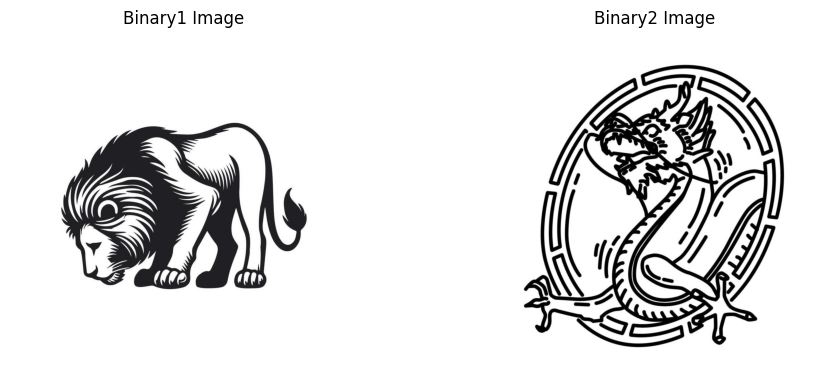

#### 1. Suma de imágenes con ponderación: Cargar dos imágenes del mismo tamaño y combı́nalas con una ponderación especı́fica usando la función cv2.addWeighted().

Se decidío crear varias imágenes usando una ponderación que va incrementando α en 0.20 cada iteración.

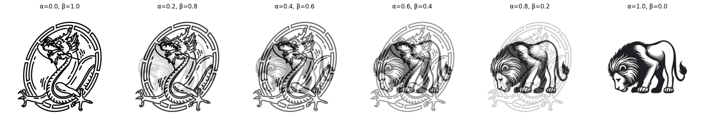

#### 2. Resta de imágenes: Realizar la resta de dos imágenes para resaltar las diferencias entre ellas con cv2.subtract().

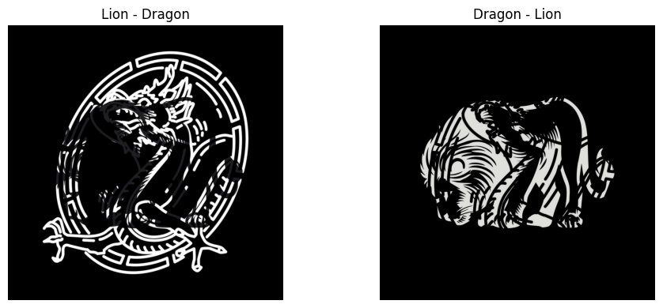

#### 3. (*) Multiplicación y división de imágenes: Multiplicar y divide dos imágenes pı́xel a pı́xel utilizando cv2.multiply() y cv2.divide(), observando cómo afecta el brillo y contraste.

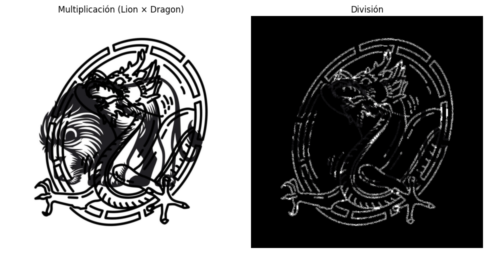

La multiplicación de imágenes tiende a aumentar el brillo en áreas con valores de píxel altos, pero puede oscurecer las áreas con valores bajos, reduciendo el contraste en esas zonas. Además, si los valores de los píxeles exceden el rango máximo (255 en imágenes de 8 bits), puede haber saturación.

La división de imágenes suele reducir el brillo de las áreas más brillantes si el valor del denominador es alto, mientras que puede aumentar el brillo de las áreas oscuras si el denominador tiene valores bajos. La división puede también reducir el contraste, especialmente en áreas donde la diferencia de valores entre las imágenes es pequeña, y si un valor en el denominador es cercano a cero, puede provocar un aumento de brillo en ciertas zonas. 

#### 4. Máscara binaria con operadores relacionales: Convierte una imagen a escala de grises y genera una máscara binaria donde los valores sean mayores a un umbral con operadores relacionales (¿, ¡).

Se usó un **threshold** mayor o igual a 100 y otro menor a 100

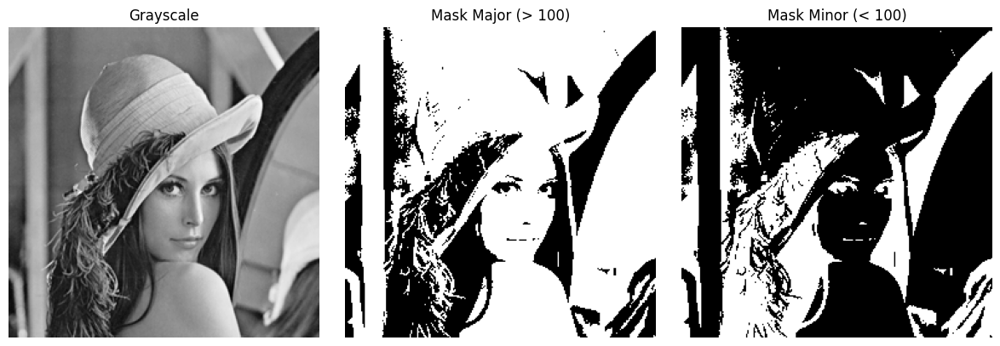

#### 5. (*) Combinación con operadores lógicos: Usa operadores booleanos (cv2.bitwise and, cv2.bitwise or, cv2.bitwise xor) para fusionar imágenes basándose en una máscara binaria. Describir que sucede en cada caso.

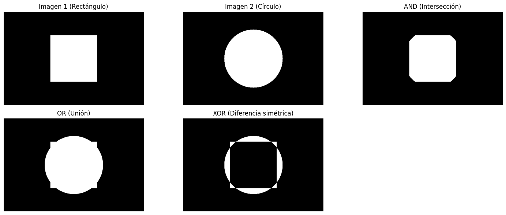

- **and** Mantiene solo los píxeles donde ambas imágenes tienen valores distintos de cero en el área de la máscara. Es útil para extraer regiones comunes: si un píxel es negro (0) en una imagen o en la máscara, el resultado será negro.

- **or** Combina todas las áreas donde al menos una imagen tiene píxeles no nulos en la máscara. Si un píxel es blanco (255) en una imagen o en la máscara, el resultado será blanco.

- **xor** Destaca píxeles donde solo una de las imágenes tiene valores no nulos (exclusividad). Si un píxel difiere entre las dos imágenes (una es blanca y la otra negra), XOR lo mostrará como blanco; si son iguales, será negro.

#### 6. Creación de una imagen compuesta: Utilizar una imagen con fondo negro y otra con fondo blanco, aplicando una máscara binaria para superponer un objeto de una imagen sobre otra.

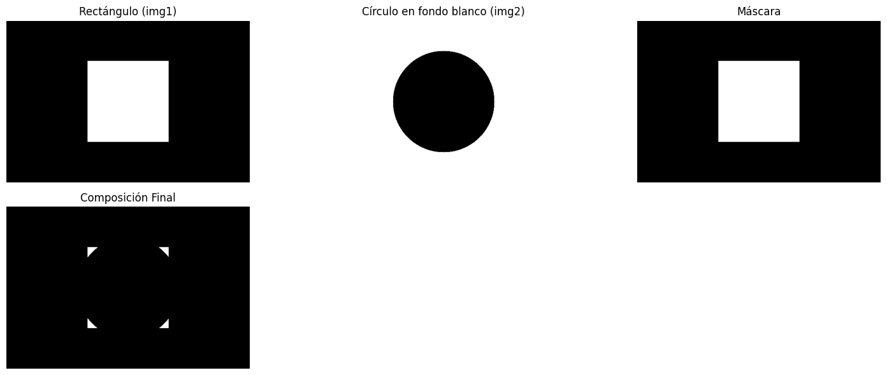

#### 7. Operaciones avanzadas con imágenes en color: Cargar imágenes en color y realiza operaciones ar- itméticas como suma y resta, observando cómo afectan cada canal de color (R, G, B).

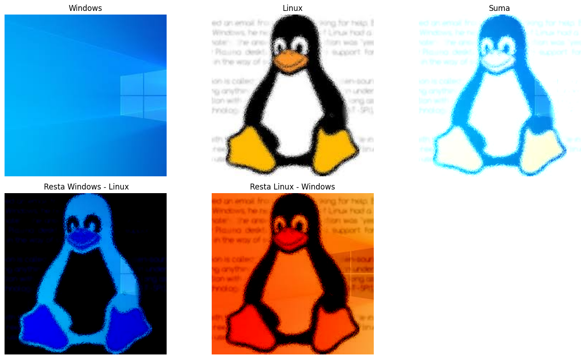

Al sumar imágenes, los valores de cada canal aumentan, lo que puede intensificar el brillo de los colores, pero si se excede el valor máximo (255), se produce saturación, haciendo que los colores se vean más claros o incluso blancos en áreas específicas. En la resta, los valores de cada canal disminuyen, oscureciendo los colores y pudiendo llevar a valores cercanos a cero, lo que genera tonos más oscuros o negros. 

#### 8. (*) Uso de operadores lógicos para reemplazar partes de una imagen: Reemplazar un área especı́fica de una imagen con otra utilizando operadores lógicos y relacionales para definir la región de interés (ROI).

Se utilizó la siguiente máscara: $$(\text{Red} > 100) \land (\text{Blue} > 200) \lor \lnot(\text{Green} < 100)$$

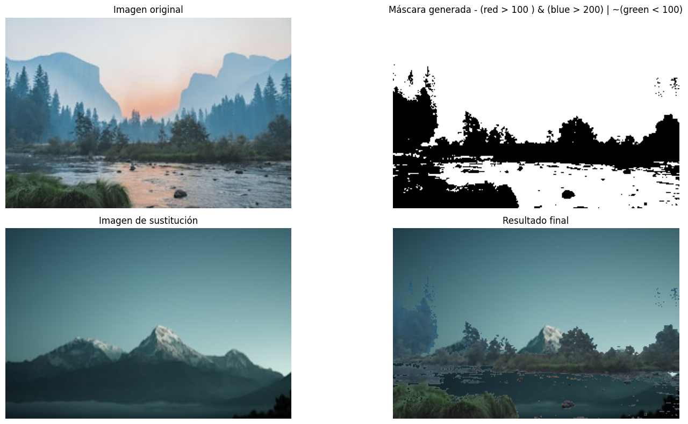

### Parte 3: Dominio Espacial

#### 1. Filtro de Media: Implementar un filtro de media en una imagen usando convolución con un kernel de promediado.

Se utilizó el siguiente kernel: 

$$
K = \frac{1}{9} \begin{bmatrix} 
1 & 1 & 1 \\ 
1 & 1 & 1 \\ 
1 & 1 & 1 
\end{bmatrix}
$$

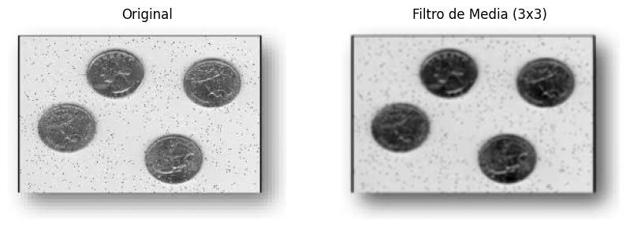

#### 2. Filtro de Mediana: Aplicar un filtro de mediana para reducir el ruido en una imagen.

Se utilizó un kernel de tamaño $3 \times 3$  

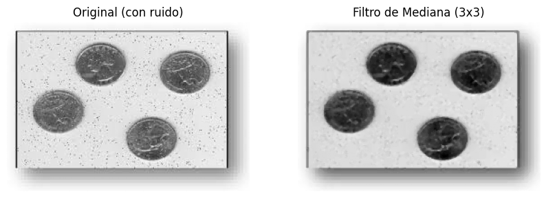

#### 3. Filtro Gaussiano: Aplicar un filtro gaussiano para suavizar una imagen y analizar su efecto en los bordes.

**Filtro Gaussiano 2D**:

$$
G(x,y) = \frac{1}{2\pi \sigma^2} e^{-\frac{x^2 + y^2}{2\sigma^2}}
$$

- **Tamaño del kernel**: $5 \times 5$  
- **Desviación estándar ($\sigma$)**: 1.5

El filtro Gaussiano suaviza la imagen , lo que reduce el ruido de alta frecuencia. Esto genera que los bordes se ven menos definidos. En la imagen (5x5, σ=1.5), se nota que las monedas pierden nitidez en sus contornos, y el ruido salpicado de la imagen original disminuye visiblemente.

#### 4. Filtro Laplaciano: Aplicar el operador de Laplace para detectar bordes en una imagen en escala de grises.

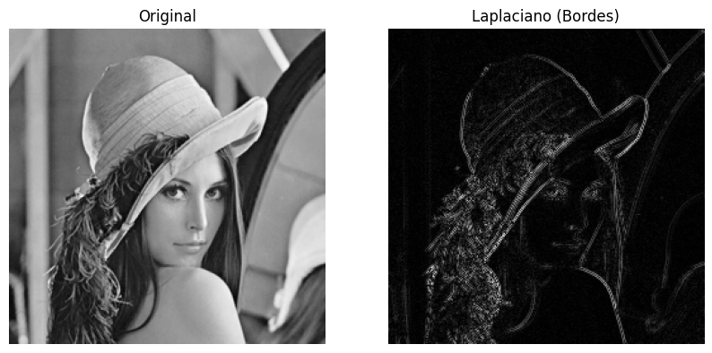

#### 5. Filtro de Sobel: Calcular el gradiente de una imagen usando los filtros de Sobel en las direcciones X e Y.

Se usó un kernel de $3 \times 3$  

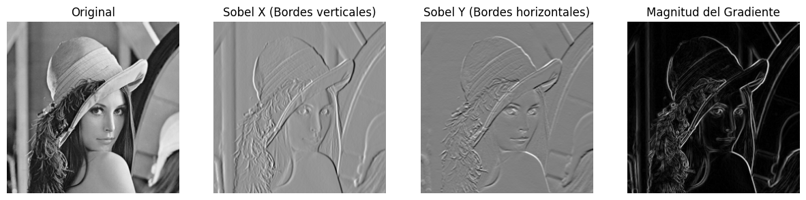

#### 6. Filtro de Scharr: Comparar el resultado del filtro de Sobel con el filtro de Scharr.

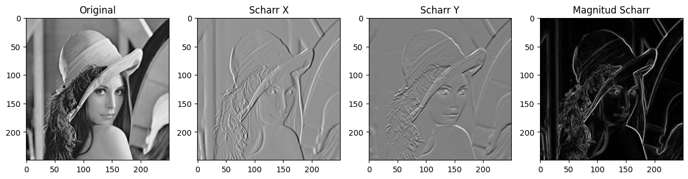

Podemos apreciar la comparación entre el filtro de **Sobel** y el de **Scharr** a continuación:

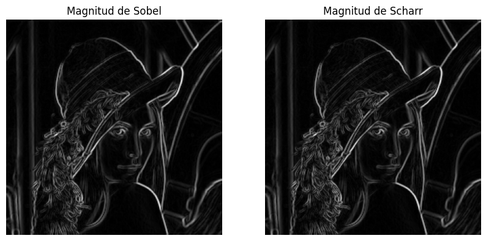

El filtro de Scharr tiene más precisión en bordes inclinados o detalles finos. La magnitud de Scharr muestra bordes más definidos y continuos en comparación con Sobel, que tiende a generar resultados ligeramente más tenues o menos nítidos. Donde más se nota la diferencia en la imágen es en el pelo.

#### 7. Filtro de Prewitt: Aplicar el operador de Prewitt y comparar con Sobel.

**Kernels de Prewitt** (operadores gradiente):

1. **Dirección X** (horizontal):
   $$
   G_x = \begin{bmatrix} -1 & 0 & 1 \\ -1 & 0 & 1 \\ -1 & 0 & 1 \end{bmatrix}
   $$
   - Responde a cambios **verticales** en la imagen.

2. **Dirección Y** (vertical):
   $$
   G_y = \begin{bmatrix} 1 & 1 & 1 \\ 0 & 0 & 0 \\ -1 & -1 & -1 \end{bmatrix}
   $$
   - Responde a cambios **horizontales** en la imagen.

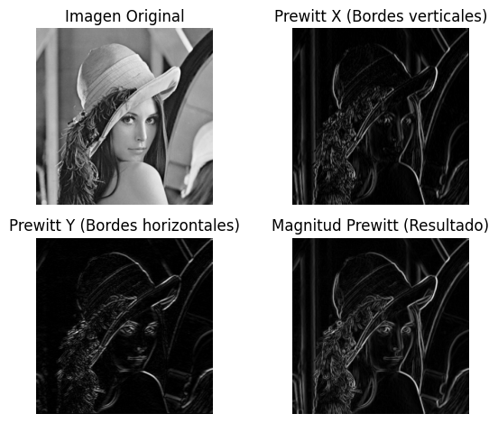

Podemos apreciar la comparación entre el filtro de **Prewitt** y el de **Sobel** a continuación:

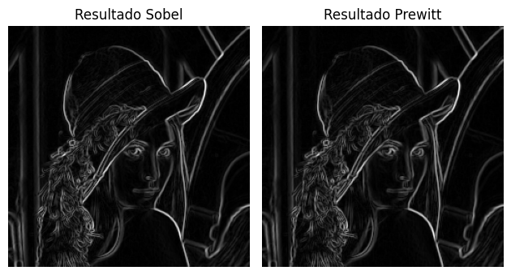

Ambos producen resultados similares, el filtro de Sobel aplica una mayor ponderación a los píxeles centrales, lo que lo hace más sensible a los cambios de intensidad y le permite resaltar mejor los bordes en condiciones de ruido. Por otro lado, Prewitt utiliza un enfoque más simple, con coeficientes uniformes, lo cual puede generar bordes ligeramente menos definidos. En las imágenes procesadas en este ejemplo es muy complicado encontrar diferencias.

#### 8. Suavizado y Sobel (*): Aplicar un filtro gaussiano antes del operador de Sobel y analizar las diferencias en la detección de bordes.

En el filtro Gaussiano se aplicó la siguiente configuración:
- **Tamaño del kernel**: $5 \times 5$  
- **Desviación estándar ($\sigma$)**: 1

Mientras que en el fitrlo de Sobel se aplicó la siguiente configuración:

- **Tamaño del kernel**: $3 \times 3$  

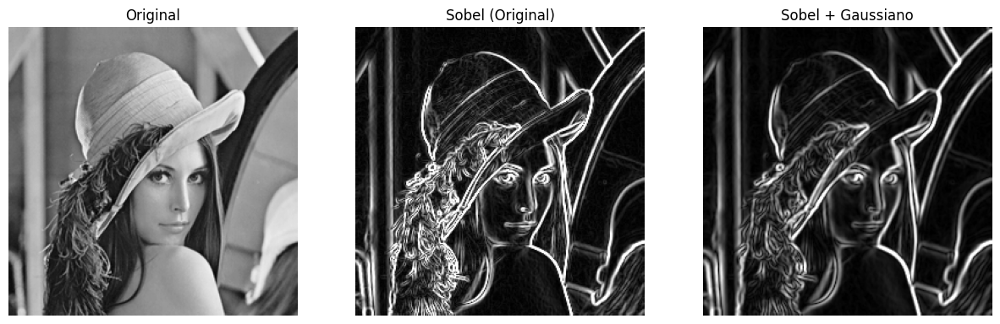

Aplicar un filtro gaussiano antes del operador de Sobel permite reducir el ruido presente en la imagen. En la comparación, se observa que el resultado de aplicar Sobel directamente sobre la imagen original presenta bordes más marcados, pero también puede acentuar el ruido. En cambio, al aplicar primero el suavizado gaussiano, los bordes se ven ligeramente más suaves pero más limpios y definidos, mostrando únicamente las estructuras más relevantes de la imagen.

#### 9. Filtro Laplaciano del Gaussiano (LoG): Aplicar un filtro gaussiano seguido de un operador de Laplace para detectar bordes.

En el filtro Gaussiano se aplicó la siguiente configuración:
- **Tamaño del kernel**: $5 \times 5$  
- **Desviación estándar ($\sigma$)**: 1.2

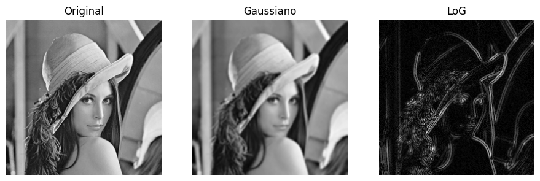

#### 10. Filtro de Paso Alto Personalizado: Implementar un filtro de realce de bordes con una matriz de convolución personalizada.

Se usó el siguiente kernel de paso alto personalizado:

$$
K = \begin{bmatrix} 
1 & 2 & 1 \\ 
0 & 0 & 0 \\ 
-1 & -2 & -1 
\end{bmatrix}
$$

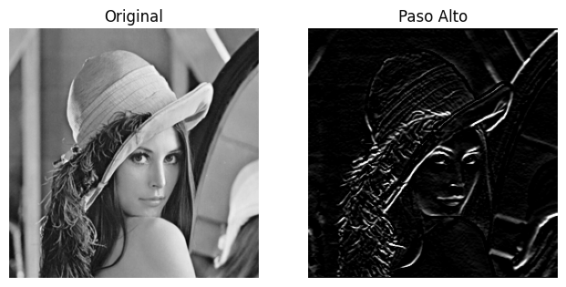

#### 11. Filtro Canny: Aplicar el detector de bordes de Canny y ajustar los umbrales para obtener diferentes resultados.

Breve explicación de ls valores threshold de Canny:

1. **`threshold1` (umbral bajo)**:
   - **Valores de gradiente por debajo de este umbral** se descartan (no son considerados bordes).  
     *Ejemplo: 50*.

2. **`threshold2` (umbral alto)**:
   - **Valores de gradiente por encima de este umbral** se consideran bordes fuertes.  
     *Ejemplo: 150*.

3. **Bordes débiles**:
   - Los píxeles con valores de gradiente **entre `threshold1` y `threshold2`** se conservan **solo si están conectados a bordes fuertes**.  
   - Si no están conectados, se descartan (supresión de bordes no relevantes).

---

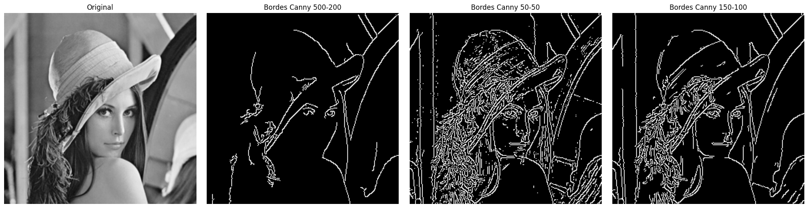

#### 12. (*) Comparación de Métodos de Detección de Bordes : Comparar Sobel, Prewitt, Laplace y Canny trabajando diversas imágenes con caracterı́sticas diferentes.

Se va a trabajar con las siguientes imágenes:

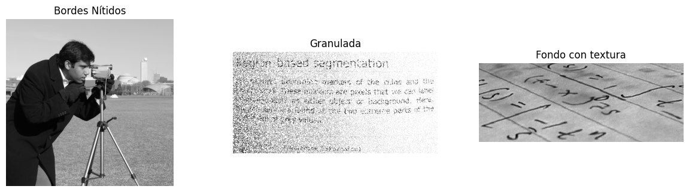

A continuación podemos ver las distintas imágenes con los distintos filtros aplicados:

En el filtro de Sobel se aplicó la siguiente configuración:
- **Tamaño del kernel**: $3 \times 3$  

En el filtro de Prewitt se utilizaron los kernels definidos por defecto por Prewitt (Descriptos en el inciso 7)

En el filtro de Laplace se aplicó la siguiente configuración:
- **Tamaño del kernel**: $3 \times 3$ 

En el filtro de Canny se aplicó la siguiente configuración:
- **threshold1**: 150
- **threshold2**: 100

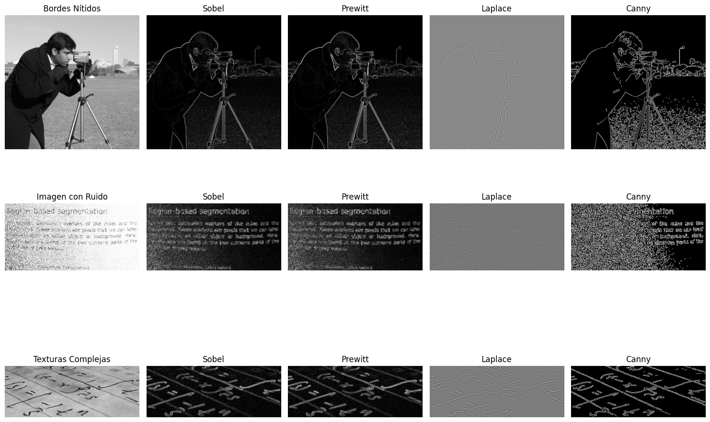

En la foto del hombre con la cámara, Sobel y Prewitt destacan por su nitidez en las siluetas, mientras que Laplace genera una imagen más tenue y con menos detalle. Mientras que Canny tiene problemas con el suelo de la imágen. 

En la imagen con mucho ruido, Laplace responde excesivamente al ruido, generando una textura muy saturada y poco útil. Sobel y Prewitt logran capturar el texto pero con bastante interferencia del ruido. Canny tiene los mismos problemas que con la fila de arriba. Ningun filtro logra quitar el rudio de la imágen ya que esta posee demasiado. 

En la imágen con texturas complejas como fórmulas matemáticas, todos los métodos detectan contornos, pero Sobel y Prwitt logran un mejor equilibrio entre detalle y claridad. Canny, especialmente, sobresale por separar con precisión las estructuras relevantes del fondo. 

#### 13. (*) Realce de Detalles: Aplicar un filtro de paso alto y sumarlo a la imagen original para mejorar los detalles.

Se usó el siguiente kernel de paso alto personalizado:

$$
K = \begin{bmatrix} 
1 & 2 & 1 \\ 
0 & 0 & 0 \\ 
-1 & -2 & -1 
\end{bmatrix}
$$

y se usó un **α** = 0.80 y un **β** = 0.20

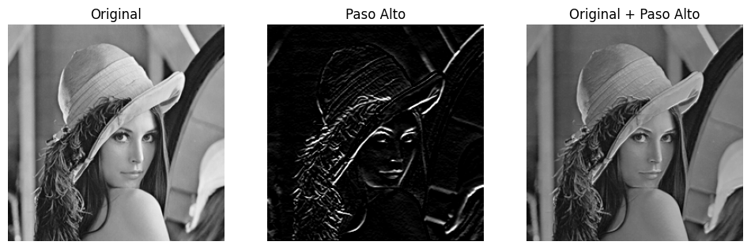

#### 14. Reducción de Ruido con Bilateral Filter: Aplicar un filtro bilateral para suavizar la imagen sin perder detalles importantes.

Parámetros usados en el filtro bilateral:

- **`d`**: Tamaño del vecindario usado para el filtrado: *9* .   
  > Determina cuántos píxeles alrededor se consideran.

- **`sigmaColor`**: Rango de colores para mezclar: *75*.  
  > Cuánto puede variar el color para seguir considerándose "similar".

- **`sigmaSpace`**: Influencia de píxeles según la distancia espacial: *75*.  
  > Define cuánto influye un píxel lejano en el valor del central.

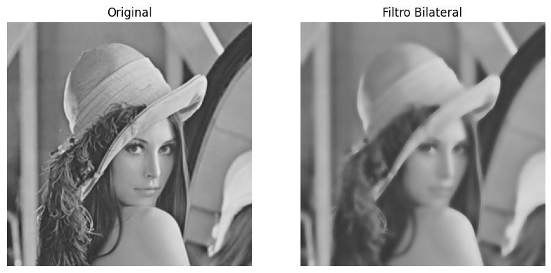

#### 15. (*) Filtro de Diferencia Gaussiana (DoG): Aplicar la técnica de Diferencia de Gaussiana para resaltar bordes.

En el primer filtro Gaussiano se aplicó la siguiente configuración:
- **Tamaño del kernel**: $5 \times 5$  
- **Desviación estándar ($\sigma$)**: 1.0

En el segundo filtro Gaussiano se aplicó la siguiente configuración:
- **Tamaño del kernel**: $5 \times 5$  
- **Desviación estándar ($\sigma$)**: 3.0

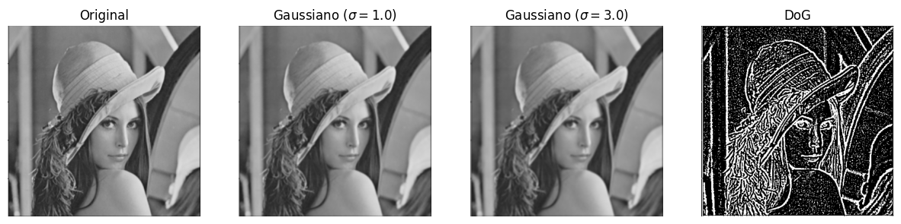