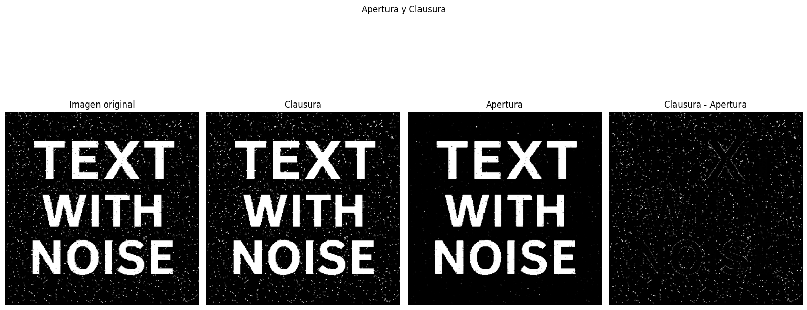
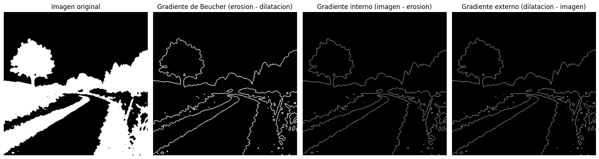
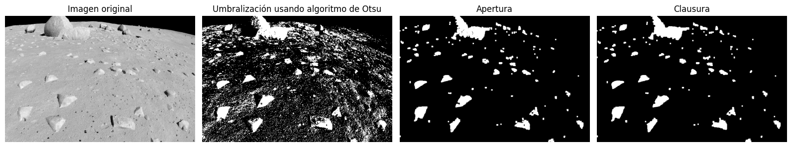

# Procesamiento de Imágenes - 2025
## TP3

### Integrantes
- **Andrés Maglione** - **13753**
- **Yeumen Silva** - **13693**

### Introducción
El presente trabajo práctico corresponde a la unidad 3 de la materia Procesamiento de Imágenes. En esta ocasión, se abordan conceptos fundamentales relacionados con los operadores morfológicos, aplicados a imágenes binarias y de bordes. Para ello, se emplea el lenguaje de programación Python, utilizando librerías como OpenCV, NumPy y Matplotlib.

El objetivo principal es comprender y analizar el impacto de las distintas operaciones morfológicas como erosión, dilatación, apertura, clausura, gradiente morfológico y técnicas combinadas con umbralización sobre imágenes digitales. Estas técnicas permiten modificar la estructura de los objetos presentes en una imagen, siendo especialmente útiles en tareas de mejora visual, relleno de objetos, eliminación de ruido y detección de bordes.

Este documento presenta una descripción general de los ejercicios desarrollados y las respuestas a las preguntas teóricas planteadas en el trabajo. Para consultar el código fuente y los resultados completos, se puede acceder al notebook (`TP3.ipynb`) o al PDF generado (`TP3.pdf`).

### Ejercicios

#### 4. (*) Apertura y clausura morfológica: Aplicar apertura y clausura para eliminar ruido o cerrar huecos. Comparar la imagen original y la resultante de aplicar el operador. Comentar los efectos visuales. Comparar con los resultados anteriores. Mostrar 4 subplots: original, apertura, cierre, diferencia entre ambos.


Los efectos resultados fueron los siguientes:
La apertura elimina el ruido de fondo, eliminando casi todos los puntos pero sin rellenar los huecos. La clausura, por otro lado, rellena los huecos y elimina el ruido de fondo, pero no afecta a los objetos grandes. Al mostrar la diferencia (Clausura - Apertura) se puede ver una imagen que contiene casi únicamente el ruido de fondo y una pequeña silueta de las letras, ya que la apertura elimina el ruido de fondo y la clausura lo rellena. 
Ya que la imagen original no tenía grandes secciones sin conectar, la diferencia inversa (Apertura - Clausura) no muestra nada significativo y por eso no se muestra.

--- 
Fragmento de código:
```python
image_path = './img_binarias/bin2.png'
image = cv2.imread(image_path, cv2.IMREAD_GRAYSCALE)

kernelToUse = kernel4

# opening
opening = cv2.morphologyEx(image, cv2.MORPH_OPEN, kernelToUse)
# closing
closing = cv2.morphologyEx(image, cv2.MORPH_CLOSE, kernelToUse)

plt.figure(figsize=(16, 8))
# 1. Original Image
plt.subplot(1, 4, 1)
plt.imshow(image, cmap='gray')
plt.title('Imagen original')
plt.axis('off')

# 2. clausura
plt.subplot(1, 4, 2)
plt.imshow(closing, cmap='gray')
plt.title('Clausura')
plt.axis('off')

# 3. apertura
plt.subplot(1, 4, 3)
plt.imshow(opening, cmap='gray')
plt.title('Apertura')
plt.axis('off')


#4. apertura - clausura
plt.subplot(1, 4, 4)
plt.imshow(cv2.subtract(closing,opening), cmap='gray')
plt.title('Clausura - Apertura')
plt.axis('off')
plt.suptitle('Apertura y Clausura')

plt.tight_layout() # Adjust rect to make space for suptitle
plt.show()
```

#### 5. (*) Operación de gradiente morfológico: Aplicar el gradiente morfológico (dilatación - erosión). Visualizar los bordes obtenidos mediante esta operación.


Fragmento de código:
```python
# Gradiente morfologico
image_path = './img_binarias/bin3.png'
image = cv2.imread(image_path, cv2.IMREAD_GRAYSCALE)

kernelToUse = kernel4

# erosion
erosion = cv2.erode(image, kernelToUse, iterations=1)
# dilation
dilation = cv2.dilate(image, kernelToUse, iterations=1)
# opening
opening = cv2.morphologyEx(image, cv2.MORPH_OPEN, kernelToUse)
# closing
closing = cv2.morphologyEx(image, cv2.MORPH_CLOSE, kernelToUse)

## Beucher gradient
beucher_gradient = cv2.subtract(dilation, erosion)

# Gradiente interno
internal_gradient = cv2.subtract(image,erosion)

# Gradiente externo
external_gradient = cv2.subtract(dilation,image)
```

#### 7. (*) Segmentación básica con umbral + morfología: Aplicar umbral, luego apertura y cierre para mejorar el resultado. Ideal como paso previo a una segmentación más elaborada


Fragmento de código:
```python
image_path = "./render0036.png"

image = cv2.imread(image_path, cv2.IMREAD_GRAYSCALE)

## Umbralizacion usando otsu
_, binary_image = cv2.threshold(image, 175, 255, cv2.THRESH_BINARY)

## Apertura
kernel = np.ones((5, 5), np.uint8)

opening = cv2.morphologyEx(binary_image, cv2.MORPH_OPEN, kernel)

## Cierre
closing = cv2.morphologyEx(opening, cv2.MORPH_CLOSE, kernel)
```