# Procesamiento de Imágenes - 2025
## TP4

### Integrantes
- **Andrés Maglione** - **13753**
- **Yeumen Silva** - **13693**

### Introducción
El presente trabajo práctico corresponde a la Unidad 4 de la materia Procesamiento de Imágenes. En esta oportunidad, se exploran conceptos esenciales relacionados con la Transformada de Fourier bidimensional (2D) y su aplicación en el análisis de imágenes en el dominio de la frecuencia.

El objetivo principal es comprender y analizar cómo las distintas representaciones y operaciones en el dominio frecuencial permiten modificar, filtrar y mejorar imágenes, así como extraer información relevante sobre su contenido estructural. Se hace especial énfasis en el rol que cumplen la magnitud, la fase, y los distintos tipos de filtros (ideales y gaussianos, pasa bajos y pasa altos).

Este documento presenta una descripción general de los ejercicios desarrollados y las respuestas a las preguntas teóricas planteadas en el trabajo. Para consultar el código fuente y los resultados completos, se puede acceder al notebook (`TP4.ipynb`) o al PDF generado (`TP4.pdf`).

Los siguiente ejercicios se llevarán acabo principalmente con dos imágenes, una con predominancia de frecuencias bajas y otra con predominancia de frecuencias altas. Esto permitirá observar las diferencias en el espectro de magnitud y fase, así como los efectos de los filtros aplicados.

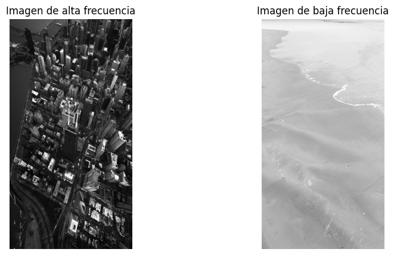

### Ejercicios

#### 10. (*) Responder las siguientes preguntas. Tratar de utilizar dos imágenes en aquellos ejercicios que no soliciten algo particular. Utilizar una imagen que muestre frecuencias bajas en su mayorı́a y otras con mayorı́a de frecuencias altas. Por cada pregunta se ha agregado una sugerencia de como realizar el ejercicio practico para acompañar su respuesta.

##### (a) ¿Cómo se visualiza la diferencia entre las frecuencias altas y bajas en una imagen? Ejercicio sug- erido: Aplicar la Transformada de Fourier (DFT) y mostrar la magnitud del espectro centrado con fftshift.

Al aplicar la DFT a una imagen y visualizar la magnitud del espectro, podemos observar que la mayoría de la energía de la imagen se concentra en el centro del espectro. Esto se debe a que las frecuencias bajas (que corresponden a las áreas homogéneas de la imagen) están cerca del origen. 
En este ejemplo en particular, la imagen de la izquierda tiene un espectro con gran presencia de frecuencias altas, mientras que la imagen de la derecha tiene un espectro con predominancia de frecuencias bajas, por lo que se puede observar que la mayoría de la energía está concentrada en el centro del espectro.

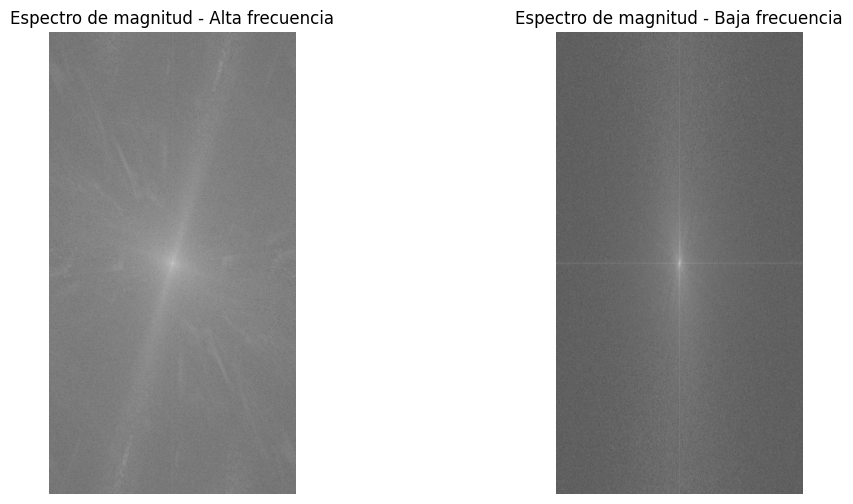

##### (b) ¿Qué ocurre si eliminamos las componentes de alta frecuencia de una imagen? ¿Y si eliminamos las de baja frecuencia? Ejercicio sugerido: Aplicar filtros pasa bajos y pasa altos en el dominio de la frecuencia y reconstruir la imagen con la transformada inversa.
Si eliminamos las componentes de alta frecuencia, la imagen resultante se verá más suave y con menos detalles, ya que las frecuencias altas son responsables de los bordes y los detalles. Por otro lado, si eliminamos las componentes de baja frecuencia, se pierde la información de fondo o estructura general de la imagen, por lo que el resultado se asemeja a un mapa de bordes, en el que solo las transiciones abruptas son visibles.

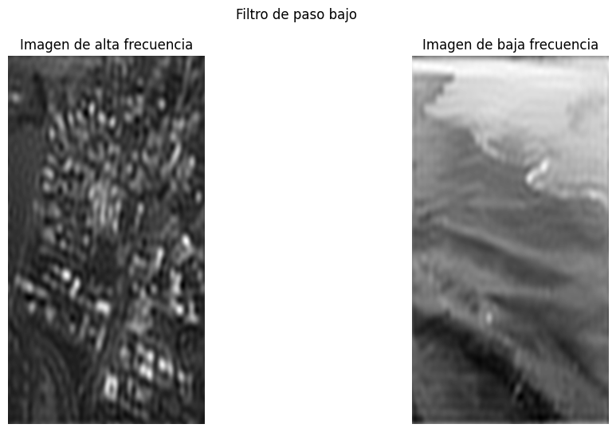
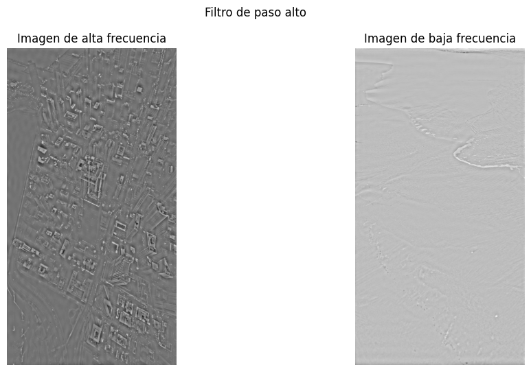

##### (c) ¿Qué representa la fase de la transformada de Fourier de una imagen? ¿Qué ocurre si se conserva solo la fase o solo la magnitud? Ejercicio sugerido: Reconstruir una imagen usando solo la magnitud y fase de otra imagen, intercambiar fase y magnitud entre dos imágenes distintas.

La  fase de una frecuencia en particular nos dice dónde están ubicadas espacialmente las características que generan esa frecuencia (es decir, codifica la información de la posición de los detalles en la imagen). Si intercambiamos la fase y la magnitud entre dos imágenes, obtendremos una imagen que tiene la estructura de una imagen (la fase) pero con la textura de otra (la magnitud). Esto provoca que la imagen resultante sea mucho más parecida a la imagen de la que se tomó la fase, como se verá en el siguiente ejemplo.

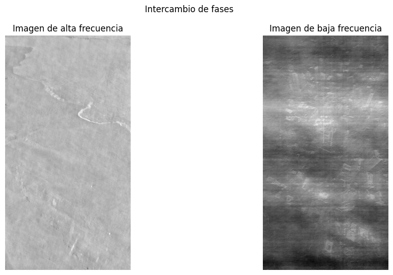

##### (d) ¿Por qué se centra la transformada de Fourier para su visualización? ¿Qué efecto tiene? Ejercicio sugerido: Mostrar el espectro de magnitud con y sin aplicar fftshift.

La transformada de Fourier se centra para su visualización principalmente por razones de conveniencia. Al centrar la transformada, las frecuencias bajas quedan en el centro y las altas en la periferia, lo que se alinea con nuestra intuición sobre mayor distancia al centro = mayor magnitud.
Además, al realizar esta operación se hacen evidentes las simetrías que pueden existir en el espectro, y se facilita la aplicación de operaciones como los filtros de frecuencia.

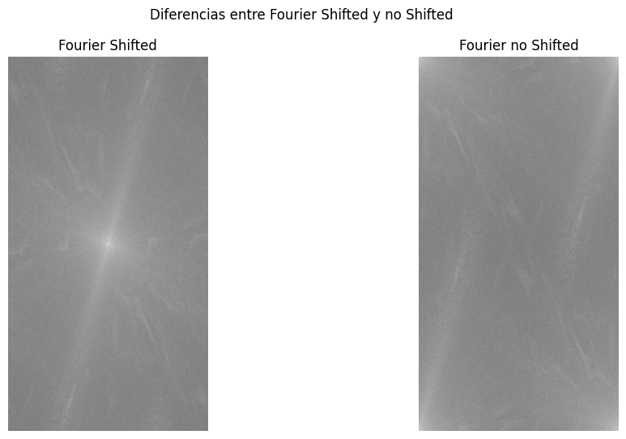

##### (e) ¿Cómo se comporta la transformada de Fourier ante la traslación o rotación de una imagen? Ejercicio sugerido: Aplicar una traslación o rotación y comparar los espectros de magnitud y fase antes y después.

Una traslación de la imagen provoca un desfase lineal en el espectro de fase, mientras que la magnitud permanece inalterada. Intuitivamente, esto se debe a que la "forma" de los objetos presentes en la imagen (codificada por la magnitud) no cambia, pero su posición (codificada por la fase) sí.

Una rotación en el dominio espacial provoca una rotación idéntica en el espectro de Fourier, tanto en la magnitud como en la fase. Esto se debe a que la rotación de la imagen afecta a todas las frecuencias de manera uniforme, lo que provoca que el espectro también rote.

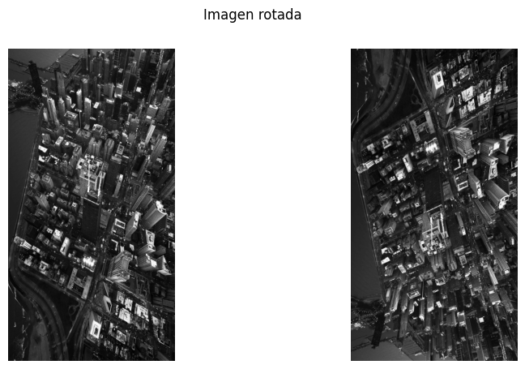
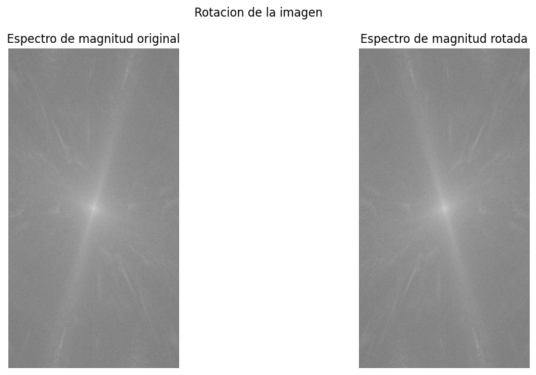
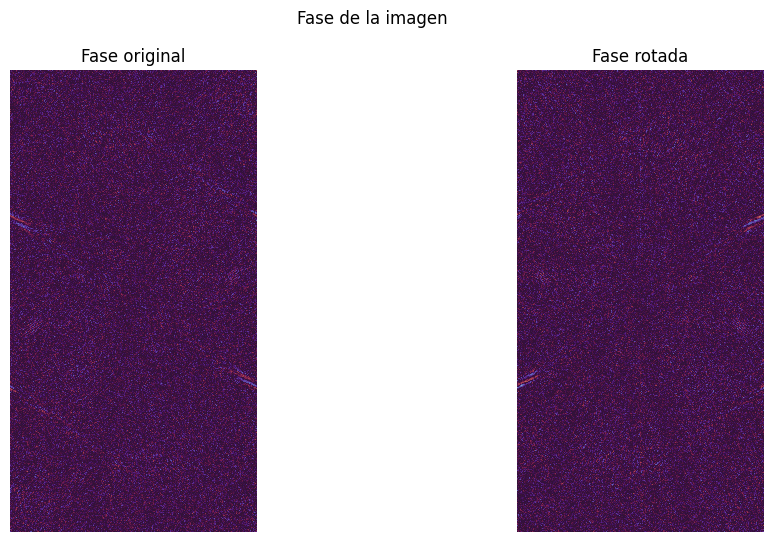

##### (f) ¿Cómo se refleja una estructura periódica en el dominio frecuencial? Ejercicio sugerido: Usar imágenes sintéticas (rejillas, lı́neas) y observar cómo se representan sus frecuencias dominantes.

Para este ejercicio se crearon 3 imágenes usando `openCV`, una imagen solo con líneas horizontales, otra solo con líneas verticales y la otra en forma de rejilla. Para cada una de ellas se graficó tanto la magnitud como la fase.

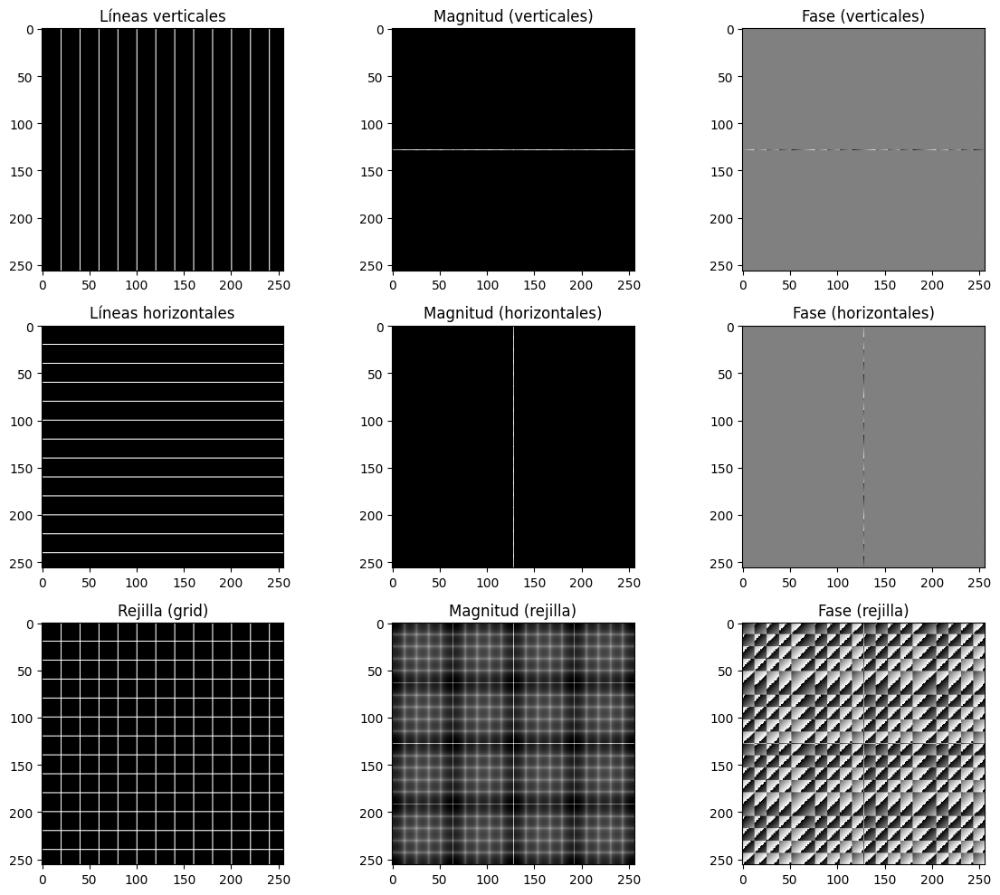

- **Líneas verticales** generan picos en la frecuencia horizontal (eje x), como se ve en la magnitud (primer fila, centro).

- **Líneas horizontales** generan picos en la frecuencia vertical (eje y), como se observa en la segunda fila.

- **Una rejilla** genera una combinación de frecuencias horizontales y verticales, produciendo una cuadrícula de picos en la magnitud (tercera fila, centro).

Esto demuestra que las estructuras periódicas en la imagen producen componentes dominantes en frecuencias específicas del dominio de Fourier.

Consultar el ejericicio 10 inciso f del pdf [`TP4.pdf`](TP4.pdf) para ver el código.

##### (g) ¿Qué diferencias se observan en el espectro de imágenes suaves vs. imágenes con bordes pro-nunciados? Ejercicio sugerido: Comparar el espectro de una imagen desenfocada vs. la original con bordes definidos.

Para este ejercicio se tomó una imagen y se le aplicó un suavizado Gaussiano con un tamaño del kernel de $25 \times 25$ y luego se graficó la magnitud y fase de la imagen original y la imagen suavizada.

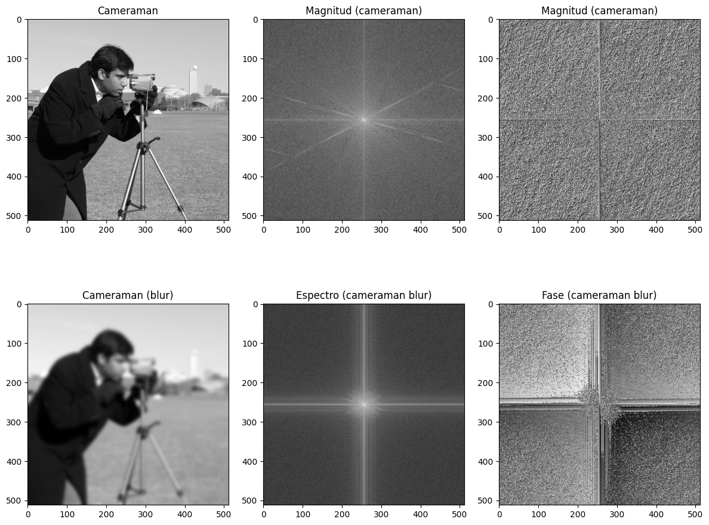

Podemos observar que la imagen con bordes pronunciados presenta un espectro de magnitud con una mayor presencia de componentes de alta frecuencia, las cuales se encuentran distribuidas lejos del centro del espectro. Estas componentes están más marcadas en direcciones dominantes, como los ejes horizontal y vertical, así como en las diagonales, lo que refleja la presencia de detalles y cambios abruptos en la imagen. En cambio, en la imagen desenfocada, el espectro muestra una mayor concentración de energía en las frecuencias bajas (cerca del centro), mientras que las altas frecuencias (alejadas del centro) están atenuadas. Esto ocurre porque el desenfoque suaviza los bordes y elimina los detalles finos.

Consultar el ejericicio 10 inciso g del pdf [`TP4.pdf`](TP4.pdf) para ver el código.

##### (h) ¿Qué ocurre si aplicamos un filtro de forma circular o rectangular en el espectro? ¿Cómo cambia la imagen? Ejercicio sugerido: Implementar máscaras ideales de paso bajo y paso alto circulares y cuadradas y observar sus efectos.

Para el siguiente ejercicio se crearon 4 máscaras, 2 de paso bajo y 2 de paso alto utilizando `openCV` (se crearon 2 en forma de círculo y 2 en forma de cuadrado). Luego se graficaron los resultados.

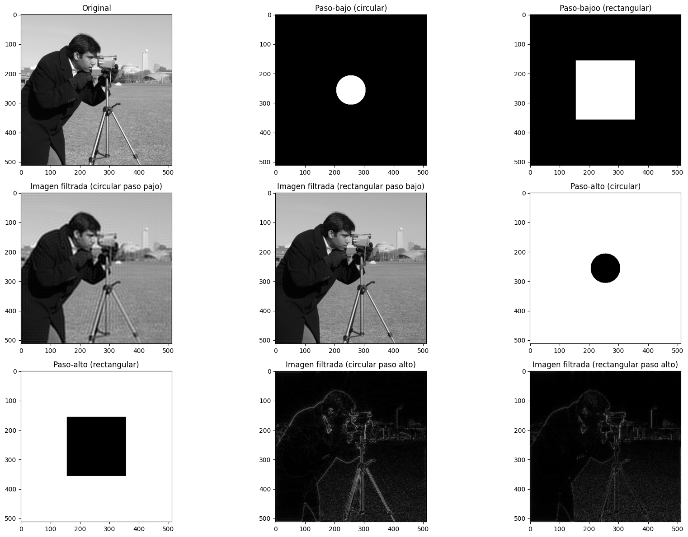

Podemos observar como en los filtros de paso bajo, tanto el círculo como el cuadrado están centrados y, por lo tanto, dejan pasar las frecuencias bajas (centro del espectro) mientras que eliminan las altas y por eso las imágenes filtradas se ven más suaves y borrosas, ya que se eliminaron los detalles como bordes y texturas. También podemos notar como al ser el cuadrado más grande, este tiene un rango más amplio y deja pasar frecuencias más altas que el círculo por eso la imagen se ve menos nítida.

Para los filtros de paso alto vemos que estos bloquean las frecuencias bajas y dejan pasar las altas y como resultado tenemos que las imágenes son mucho más oscuras y resaltan los contornos, ya que solo conservan las variaciones rápidas de intensidad.

Consultar el ejericicio 10 inciso h del pdf [`TP4.pdf`](TP4.pdf) para ver el código.

##### (i) ¿Cuál es la relación entre el patrón de una imagen (orientación, repetición) y la simetrı́a del espectro? Ejercicio sugerido: Usar imágenes diagonales o repetitivas y analizar la simetrı́a del espectro.

Se crearon dos imágenes con patrones repetitivos, una la cual tiene líneas diagonales y otra en forma de rejilla y luego se analizó su magnitud y su fase.

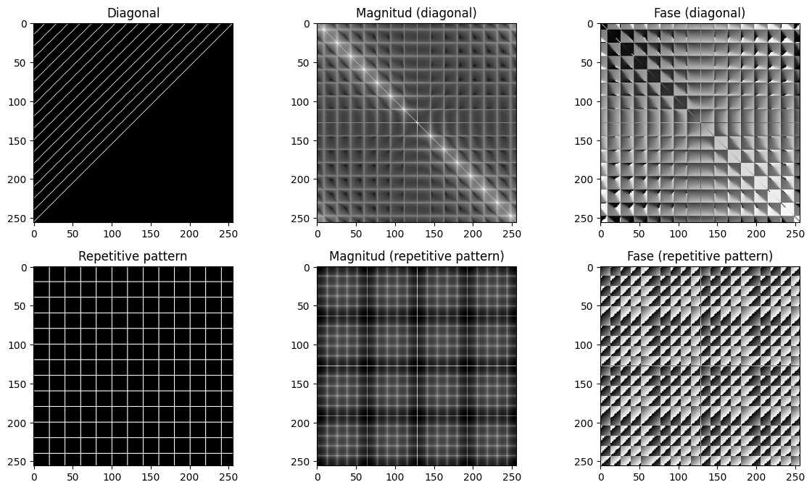

En la imagen en diagonal vemos como el espectro muestra una distribución fuerte a lo largo de la diagonal opuesta. Esto se debe a que la orientación del espacio se refleja como simetría cruzada en el dominio frecuencial. Se mantiene la simetría central del espectro si el patrón está en diagonal, las frecuencias dominantes están alineadas con esa orientación.

En la imagen cuadricular aparecen picos bien definidos y simétricos distribuidos regularmente en el espectro, indicando la repetición en el espacio. La regularidad del patrón se traduce en simetría y periodicidad en el espectro.

Consultar el ejericicio 10 inciso i del pdf [`TP4.pdf`](TP4.pdf) para ver el código.

##### (j) ¿Cómo puede usarse el dominio frecuencial para eliminar ruido periódico en una imagen? Ejer- cicio sugerido: Introducir ruido periódico artificialmente y diseñar un filtro para suprimirlo en el dominio de la frecuencia.

Para este ejercicio, se utilizó una imagen en escala de grises a la cual se le añadió ruido periódico artificial, simulado mediante una función senoidal que varía en dos direcciones.

Una vez transformada la imagen al dominio de la frecuencia utilizando la Transformada de Fourier 2D y centrando el espectro con fftshift, se diseñó un filtro notch. Este tipo de filtro actúa bloqueando selectivamente ciertas frecuencias no deseadas, en este caso aquellas asociadas al ruido periódico, mediante una máscara circular aplicada en las posiciones correspondientes a los picos detectados.

Posteriormente, se aplicó la transformada inversa de Fourier para reconstruir la imagen en el dominio espacial.

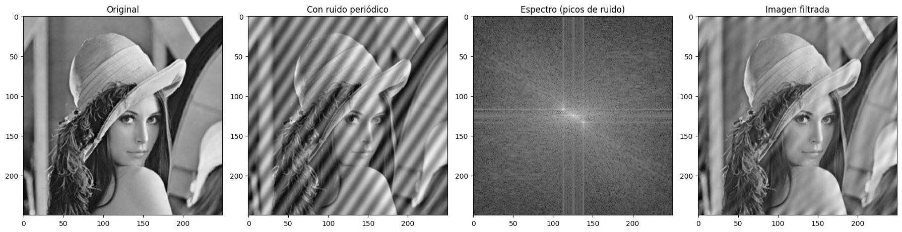

El dominio frecuencial permite aislar y eliminar ruido periódico de manera muy precisa, identificando sus componentes en el espectro y anulándolos sin afectar el resto de la imagen significativamente. Es una técnica muy potente, especialmente cuando el ruido es regular y tiene una firma espectral clara.

Para eliminar el ruido repetitivo es necesario que el espectro sea analizado por un profesional el cual entienda el problema y como interpretarlo, ya que es necesario que el profesional sea capaz de identificar las frecuencias que generan el ruido periodico. Se puede ver un ejemplo a continuación:

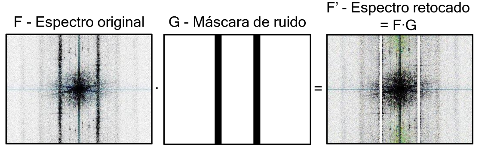

Consultar el ejericicio 10 inciso j del pdf [`TP4.pdf`](TP4.pdf) para ver el código.